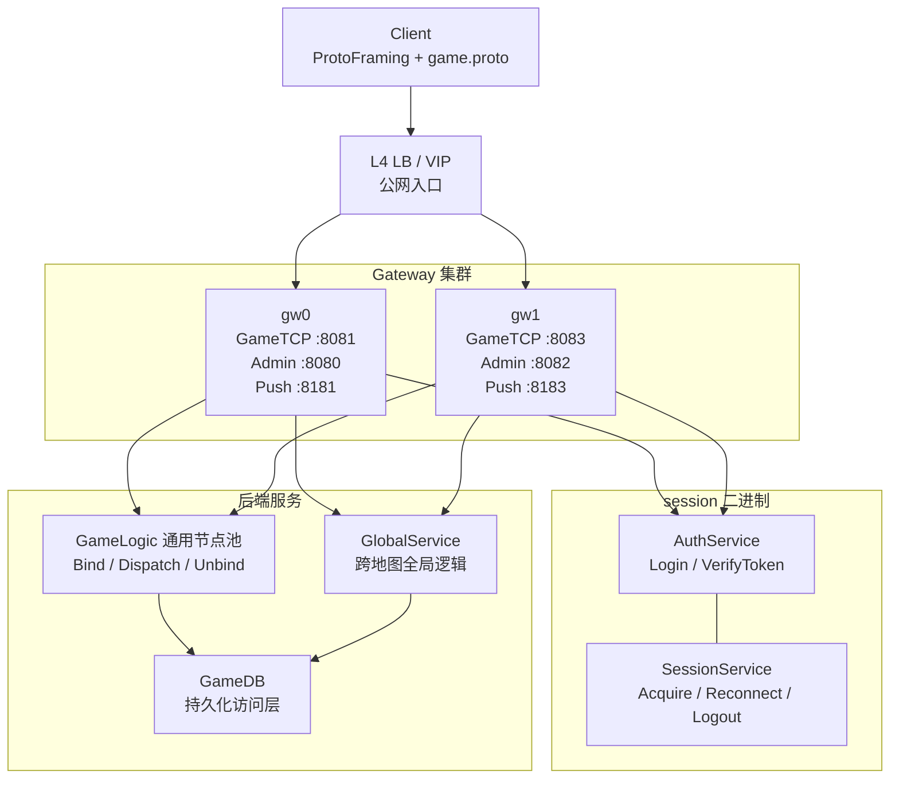

# GameMesh 分布式 MMO 游戏服务器：Cursor 全阶段实施提示词

> 目标仓库：`https://github.com/madongxin/webserver`  
> 目标分支：`main`  
> 已确认基线提交：`7553123`  
> 技术基线：C++17、Reactor、ProtoFraming、brpc、Redis、MySQL、可选 etcd

## 如何使用

把本文件完整发送给 Cursor，并让 Cursor 在项目根目录执行。

本任务必须按“阶段 0 → 阶段 1 → 阶段 2 → 阶段 3”的顺序实施。每个阶段都需要完成代码、配置、脚本、测试和文档，并通过该阶段的验收后才能进入下一阶段。如果一次上下文无法完成全部工作，应停在当前阶段的清晰检查点，输出未完成项，下一次继续执行，不能跳过验收。

---

# 给 Cursor 的总任务

你正在修改一个已经构建完成的 C++ 游戏服务器项目。它目前以单点 Reactor 高并发服务器为基础，已经接入 brpc，并开始拆分为 Gateway、Session、GameLogic、GlobalService、GameDB 等服务。

不要只输出设计方案或伪代码。请直接检查仓库、修改真实代码、补齐脚本、执行测试，并报告结果。

## 一、开始工作前必须执行

1. 阅读仓库根目录及相关子目录中的 `AGENTS.md`、`README.md`、架构文档和构建脚本。
2. 执行 `git status --short`，识别用户已有修改并完整保留，不要覆盖或回退无关改动。
3. 检查实际目录、目标名、Proto 定义、端口和启动参数，不要仅根据本提示词猜测文件路径。
4. 建立阶段任务清单；严格按阶段顺序实施。
5. 每完成一个阶段，先执行该阶段全部测试；失败时先修复，不能带着失败进入下一阶段。

## 二、全局硬约束

1. 全工程统一使用 C++17。
2. 保留现有 Reactor 网络层、ProtoFraming 和 brpc，不引入或替换为 gRPC。
3. 客户端只通过 TCP 连接 Gateway；客户端不能直接调用 GameLogic、Session、GlobalService 或 GameDB。
4. 客户端协议继续使用 `game.proto` 和现有帧协议；内部服务调用使用 brpc + Protobuf。
5. 不推翻并重写 Reactor；在现有 Reactor 基础上渐进修复和拆分。
6. 不新增独立 Login 进程。AuthService 与 SessionService 保持在同一个 session 二进制中，但代码和接口逻辑分离。
7. GameLogic 是通用逻辑节点池。任意健康 GameLogic 节点都可以承载任意 MapInstance；实际归属由权威 Placement 决定，不能写死为“某逻辑服只管理某地图”。
8. Gateway 不能成为玩家资产事实源；MySQL 是持久资产事实源，Redis 主要保存会话、Token、租约、路由和短期状态。
9. `MarkDisconnected` 只表示连接暂时断开，不能等同于 `Logout`。断线重连窗口内要保留会话和玩家逻辑归属。
10. 正式分布式模式下，每类数据必须由明确服务拥有，禁止各进程随意直连数据库修改他人数据。
11. 所有跨服务调用都必须设置 deadline，并明确重试条件；非幂等写操作不能盲目自动重试。
12. 不允许为了让脚本变绿而使用 `|| true`、吞错误、伪造测试成功或只写 `Expect(true)`。
13. 不执行 `git commit`、`git push`，不修改远端仓库。

## 三、目标拓扑



补充约束：

- Gateway 的 HTTP 管理口和 Push 接口只允许内网访问，不暴露到公网。
- GameLogic、Session、GlobalService、GameDB 使用服务发现或显式静态地址进行内部通信。
- etcd 未启动时可以使用静态 `*_addrs` 回退，但不能静默发现失败后路由到错误节点。
- 正式环境中 L4 LB/VIP 是唯一游戏公网入口。

---

# 阶段 0：稳定 Reactor、Gateway 与 C++17 构建基线

## 阶段目标

先修复当前高并发底座中的正确性和资源安全问题，使 Gateway 可以稳定承载后续分布式逻辑。本阶段不要大规模改业务服务。

## 0.1 全工程切换到 C++17

1. 检查根目录和所有子目录的 CMake 配置。
2. 统一设置：

   ```cmake
   set(CMAKE_CXX_STANDARD 17)
   set(CMAKE_CXX_STANDARD_REQUIRED ON)
   set(CMAKE_CXX_EXTENSIONS OFF)
   ```

3. 删除或替换仍强制使用 `-std=c++11`、`-std=c++14` 的配置。
4. 确保 brpc、Protobuf、测试程序和所有服务目标都继承一致标准。
5. 构建脚本必须明确打印编译器、构建类型和 C++ 标准。

## 0.2 修复连接标识和生命周期

1. Connection ID 使用进程内单调递增的 `uint64_t`，不能因窄类型回绕导致旧连接与新连接冲突。
2. 检查 Connection ID 在 Reactor、Gateway、session binding、Proto/RPC 和日志字段中的全部类型，避免隐式截断。
3. 连接关闭时必须完整清理：

   - Reactor 中的 channel、timer、receive buffer、send queue；
   - Gateway 中的 stream、player binding、pending RPC、push route；
   - 与该连接关联但尚未完成的异步回调。

4. 异步回调不能持有已经销毁连接的裸指针；使用稳定 ID、受控所有权或弱引用校验。

## 0.3 修复收包和帧解析

1. 帧解析结果必须显式区分：`Complete`、`Incomplete`、`Invalid`。
2. 半包时保留数据并等待后续字节；粘包和一次多帧时循环解析全部完整帧。
3. 非法长度、非法消息号、长度溢出和超过上限的帧必须立即拒绝并关闭连接。
4. 为每个连接设置接收缓冲上限，避免恶意客户端无限制造半包导致内存增长。
5. 检查 Buffer 的 consume、readable bytes、边界比较和扩容逻辑，修复等号边界和整数溢出。

## 0.4 修复发送队列和 EPOLLOUT

1. 为 Channel 补齐并正确调用 `DisableWrite`；发送队列清空后取消 EPOLLOUT 监听。
2. 正确处理 `EINTR`、`EAGAIN/EWOULDBLOCK`、对端关闭和其他不可恢复错误。
3. 每连接发送队列设置字节数和消息数上限。
4. 慢客户端超过限制时执行明确策略：丢弃可合并的非关键 Push，或关闭连接；不能无限积压。
5. 确保 partial write 后剩余字节不会重复发送或丢失。

## 0.5 降低全局锁影响

1. 审查 Reactor 热路径上的全局 mutex，避免整个连接表或 Buffer 表在每次收发时长期加锁。
2. 每个连接的数据只应由所属 EventLoop 修改；跨线程操作通过投递任务回到 owning loop。
3. `TcpReplySink` 和异步业务回复必须投递到连接所属 EventLoop 发送，不允许工作线程直接修改 Reactor 内部状态。
4. 这一步以消除明显竞争和长临界区为目标，不要求重写全部线程模型。

## 0.6 构建和测试脚本

新增或完善以下脚本；如果仓库已有同类脚本，应兼容并扩展，而不是重复造多个入口：

- `scripts/build.sh`：支持 Debug/Release、并行度、clean 选项，失败立即退出；
- `scripts/test_unit.sh`：运行本阶段单元测试；
- `scripts/test_reactor.sh`：运行 Reactor/ProtoFraming 集成测试；
- `scripts/run_version.sh`：打印各服务版本、Git SHA、构建类型、C++ 标准；
- `scripts/test_all.sh`：串行调用已有测试，任何一步失败则整体失败。

脚本统一使用：

```bash
set -euo pipefail
```

脚本需支持从仓库根目录执行，并通过自身路径正确定位仓库，不能依赖调用者当前目录。

## 0.7 必须补齐的测试

至少覆盖：

1. 连续生成 10000 个 Connection ID，不重复、不截断。
2. Buffer 恰好消费完全部字节。
3. 半包在第二次输入后组成完整帧。
4. 多个粘包一次全部解析。
5. 单次输入包含多个完整帧与尾部半包。
6. 非法帧长度被拒绝。
7. 超大帧触发关闭且释放缓冲。
8. 连接关闭后 stream/binding/pending callback 被清理。
9. 发送队列清空后 EPOLLOUT 被关闭。
10. 慢客户端达到上限时按配置关闭或降级，不发生无限内存增长。

## 阶段 0 验收标准

- 全部目标以 C++17 编译成功。
- Reactor 单元测试和集成测试全部真实通过。
- ASan 下执行基础连接、收包、发包、断连流程无明显 use-after-free、double-free 或泄漏。
- 构建脚本在干净 build 目录中可以完成配置、编译和测试。
- 输出本阶段修改文件、测试命令、结果和仍存在的风险。

只有满足以上条件，才进入阶段 1。

---

# 阶段 1：统一登录、会话、GameLogic RPC 与断线重连

## 阶段目标

消除新旧 GameLogic 调用链并存的问题，形成唯一正式链路：

`Client → Gateway → AuthService → SessionService → GameLogic.BindPlayer → GameLogic.Dispatch`

断线重连允许玩家连接任意 Gateway，并通过 Redis 中的权威会话恢复逻辑归属。

## 1.1 统一 GameLogic RPC

1. Gateway 的普通客户端业务消息统一走：

   - `BindPlayer`：建立玩家与 GameLogic/MapInstance 的逻辑绑定；
   - `Dispatch`：转发已鉴权玩家的具体游戏命令；
   - `UnbindPlayer`：正式退出或迁移时解除绑定。

2. 将旧 `Forward` 路径标记为 deprecated，并从正式流量路径移除；若为兼容测试暂时保留，必须有明确开关和删除计划。
3. `BrpcTransport` 支持异步 `Dispatch`，不能在 Reactor EventLoop 中同步等待 brpc 返回。
4. 每个内部 RPC 至少携带：

   - `request_id`；
   - `trace_id`；
   - `player_id`；
   - `session_id`；
   - `fence_token`；
   - `logic_server_id`；
   - `map_instance_id`；
   - `route_version`；
   - deadline 或剩余超时时间。

## 1.2 Gateway 作为可信身份边界

1. Login/Reconnect 成功前，只允许白名单消息，例如 Login、Register、Reconnect、Ping。
2. Login 成功后，Gateway 以连接绑定的 `player_id/session_id/fence_token` 覆盖或验证客户端请求中的身份字段。
3. 不能信任客户端自报的 `player_id`、GameLogic 地址、MapInstance 或路由版本。
4. 未绑定连接发送业务命令时 fail closed，并返回明确错误码。
5. 同一连接重复登录、同一账号异地登录和旧连接继续发包都必须有确定策略。

## 1.3 登录改为异步状态机

登录流程按以下步骤实现，不能在 Reactor 线程阻塞，也不能使用不可控 detached thread：

1. Gateway 校验消息格式和频率。
2. Gateway 调用 `AuthService.Login/VerifyToken`。
3. Auth 成功后调用 `SessionService.AcquireSession`。
4. Session 返回唯一 session、fence、generation 和初始路由。
5. Gateway 异步调用目标 GameLogic 的 `BindPlayer`。
6. Bind 成功后，Gateway 保存 connection ↔ player ↔ session ↔ logic route 的绑定。
7. Gateway 向客户端返回登录成功及必要的重连信息。

任一步失败必须按状态执行补偿。例如 Session 已创建但 GameLogic Bind 失败时，调用带幂等条件的 Logout/Release 回滚，不能遗留假在线会话。

## 1.4 Fence 与幂等

1. GameLogic 执行任何玩家命令前校验 `session_id + fence_token + generation`。
2. 新登录或强制顶号生成更高 fence；旧 Gateway 和旧 GameLogic 上的请求必须被拒绝。
3. GameLogic 必须校验请求目标 `logic_server_id` 和 `map_instance_id` 与当前权威归属一致。
4. 未知 `logic_server_id` 不能自动回退到地址列表第一个节点。
5. `BindPlayer`、`UnbindPlayer`、Logout、Reconnect 均需要幂等。
6. 路由发生变更时递增 `route_version` 或 epoch，旧版本请求不得覆盖新状态。

## 1.5 完整实现断线重连

1. TCP 断开时 Gateway 调用 `MarkDisconnected`，保留会话到 `reconnect_deadline`。
2. 玩家可以通过 LB 连接任意 Gateway，然后发送 `ReconnectV2`。
3. SessionService 原子校验 token/session/fence/generation 和重连窗口，并返回完整路由：

   - player；
   - session；
   - fence/generation；
   - logic server；
   - map instance；
   - route version/epoch；
   - last acknowledged server sequence（若当前阶段暂未实现回放，可保留字段并明确语义）。

4. 新 Gateway 调用 GameLogic `BindPlayer` 或 `RebindPlayer`，更新玩家的 push gateway route。
5. 成功后，新 Gateway 建立连接绑定；旧 Gateway 的过期连接和旧 fence 失效。
6. 超过重连窗口才执行正式 Logout、Unbind 和必要持久化。

## 1.6 SessionService 改为可水平扩展

1. 不允许多个 SessionService 实例共享一个非线程安全的 hiredis context。
2. 实现每线程连接或有上限的 Redis 连接池，并带连接健康检查、超时和重连。
3. 下列操作使用 Redis Lua 或事务/CAS 保证原子性：

   - AcquireSession；
   - BindRoute；
   - MarkDisconnected；
   - Reconnect；
   - Logout；
   - fence/generation 递增。

4. Redis key 设计需要包含环境/区服前缀，并设置合理 TTL。
5. SessionService 进程内不能保存不可恢复的唯一权威状态，确保启动两个实例后行为一致。

## 1.7 修复启动与路由配置

1. 检查 `start_formal` 等脚本是否只注入单个 logic ID 或只使用 `gl-0`。
2. 所有 Gateway 必须能看到完整 GameLogic 节点池。
3. 静态模式使用明确的 `logic_server_id=address` 配置，不能仅靠数组下标猜测节点身份。
4. 启动脚本等待依赖服务 ready，而不是仅检查进程存在或固定 sleep。

## 1.8 必须补齐的测试

至少覆盖：

1. 未登录客户端不能调用普通游戏命令。
2. 客户端伪造 player_id 被 Gateway 覆盖或拒绝。
3. 登录成功后普通命令只走 `Dispatch`。
4. 登录期间连接断开，不发生 use-after-free，残留会话被补偿。
5. GameLogic Bind 失败时 Session 回滚。
6. 同账号二次登录后旧 fence 请求被拒绝。
7. 断线后通过另一 Gateway 重连成功。
8. 重连超时后返回明确失败并完成 Logout/Unbind。
9. 未知 logic ID fail closed，不回退到首节点。
10. 两个 SessionService 并发 Acquire/Reconnect 时只产生一个权威结果。

## 阶段 1 验收标准

- 正式流量不再经过旧 `Forward` 路径。
- 登录、业务请求、断线、跨 Gateway 重连和正式退出流程均有可重复集成测试。
- Redis 中能查询到唯一权威 session、fence 和 route。
- 两个 SessionService 实例同时运行时结果一致。
- Reactor 线程中不存在同步等待 brpc 的代码路径。
- 输出接口变更、Proto 兼容方式、测试命令和失败补偿说明。

只有满足以上条件，才进入阶段 2。

---

# 阶段 2：实现权威 Map Placement、动态服务发现与可靠 Push

## 阶段目标

让 GameLogic 真正成为通用节点池。MapInstance 由权威 Placement 动态分配到具体 GameLogic，支持节点故障恢复和地图迁移；同时消除硬编码地址，补齐可靠 Push。

## 2.1 实现权威 Map Placement

第一版可以把 Placement 模块放在 SessionService 中，但代码边界要清晰，未来可以独立拆分。

Placement 至少维护：

- `realm_id`；
- `map_template_id`；
- `map_instance_id`；
- `owner_logic_server_id`；
- `owner_epoch`；
- `route_version`；
- `state`：CREATING、READY、FROZEN、MIGRATING、RECOVERING、CLOSED；
- `updated_at`；
- 可选 lease/heartbeat 信息。

要求：

1. `map_instance_id` 通过 Redis `INCR`、数据库序列或等价机制全局唯一，不能由单个 GameLogic 本地计数生成。
2. MapInstance 归属通过 Redis Lua/CAS 原子创建和转移。
3. 同一时刻只能有一个有效 owner epoch。
4. Gateway 和 GameLogic 只缓存 Placement，缓存不是事实源。
5. owner、epoch 或 route 变化时必须递增版本。
6. 所有写请求携带 epoch/version；旧 owner 收到新 epoch 请求或旧请求时必须拒绝。

## 2.2 进入地图流程

实现统一流程：

1. GameLogic 根据玩家请求向 Placement 查询/创建目标 MapInstance。
2. Placement 根据健康度、当前负载、节点标签和容量选择 owner GameLogic。
3. 当前 GameLogic 或 Gateway 向 owner 发送幂等的 Bind/EnterMap。
4. owner 准备好玩家实体后，更新 Session route。
5. Gateway 更新路由缓存，后续 Dispatch 指向新的 owner。
6. 任一步失败需要回滚或保持旧路由，不能让玩家进入无 owner 状态。

## 2.3 地图迁移与故障恢复

主动迁移至少包含：

1. 将旧实例置为 FROZEN，停止接受新的写命令。
2. 生成状态快照及最后序列号。
3. 新 owner 以更高 epoch 加载快照并声明归属。
4. 新 owner READY 后原子切换 Placement 和玩家 Session route。
5. Gateway 刷新路由，旧 owner 拒绝新 epoch 下的请求。
6. 重复迁移请求必须幂等，不能双写或同时出现两个 READY owner。

故障恢复至少包含：

1. Placement 检测 owner lease/健康状态失效，将实例置为 RECOVERING。
2. 选择新 owner 并分配更高 epoch。
3. 从最近快照、持久化状态或可重放日志恢复。
4. 恢复期间对玩家返回明确的“恢复中/稍后重试”，不能静默路由到任意节点。

若当前项目尚无完整状态快照机制，可以先实现接口、状态机和最小内存快照测试，但必须在文档中标明持久化恢复的限制，不能声称已具备生产级无损迁移。

## 2.4 动态服务发现

1. 评估当前 etcd v2/raw HTTP 实现；不要继续扩展已过时且无 lease/watch 的简化发现方式。
2. 优先选择以下一种与现有 brpc 兼容的实现并写清理由：

   - brpc NamingService 扩展；或
   - etcd v3 client，支持 lease、keepalive、watch。

3. 服务注册内容至少包括：service type、server ID、advertise address、RPC port、zone、weight、version、start time。
4. 注册地址不能是 `0.0.0.0`、`127.0.0.1` 或容器内不可达地址，除非明确为单机开发模式。
5. 支持 lease keepalive、watch 增量更新、优雅注销和失联自动过期。
6. brpc Channel/节点池应随发现结果动态更新，并保留有界、可观测的静态地址回退。
7. 发现失败时不能把未知 server ID 路由到第一个节点。

## 2.5 可靠 Push

1. 删除 GameLogic 中写死的 Gateway Push 地址，例如 `127.0.0.1:8181`。
2. Session route 保存玩家当前 `gateway_server_id` 和 push endpoint/version。
3. GameLogic 通过服务发现找到 Gateway 的内网 Push 地址。
4. Gateway 收到 Push 时校验：

   - gateway ID 与本机一致；
   - session/fence/generation 有效；
   - connection binding 仍是当前绑定；
   - route version 未过期。

5. PushBatch 必须异步、有 deadline、有上限，并实现 per-player server sequence。
6. 每玩家或每连接设置有界 Push 队列；状态类消息可合并，关键事件不能静默丢失。
7. 为最近一段关键 Push 维护有界 replay cache；重连时根据客户端最后确认序列回放，无法回放时触发全量快照同步。
8. 慢 Gateway 或慢客户端必须触发 backpressure 指标和明确降级策略。

## 2.6 脚本与可重复测试

新增或完善：

- `scripts/test_placement.sh`；
- `scripts/test_discovery.sh`；
- `scripts/test_push_reconnect.sh`；
- `scripts/kill_logic_and_recover.sh`；
- `scripts/run_cluster_local.sh`：启动至少 2 Gateway、2 Session、2 GameLogic、1 Global、2 GameDB 及依赖。

## 2.7 必须补齐的测试

至少覆盖：

1. 并发创建同一目标地图只产生一个权威实例。
2. 不同 MapInstance 可以分配到不同 GameLogic。
3. 同一 GameLogic 可以同时承载多个不同 MapInstance。
4. 未知 map/logic 路由被拒绝，不回退到首节点。
5. owner epoch 更新后旧 owner 写请求被拒绝。
6. 主动迁移过程中无双 READY owner。
7. kill 当前 owner 后进入 RECOVERING 并由新 owner 接管。
8. 新 GameLogic 注册后无需重启 Gateway 即可接收新实例。
9. GameLogic 能把 Push 发送到玩家实际连接的任意 Gateway。
10. 重连后可回放缺失 Push，缓存不足时触发快照同步。

## 阶段 2 验收标准

- GameLogic 不再与固定 MapInstance 静态绑定。
- Placement 是唯一权威归属源，并有 epoch/version 防止脑裂写入。
- 新增/移除服务实例无需重启整个集群。
- 代码和配置中不再硬编码特定 Gateway Push 地址。
- 多机或容器网络下注册的 advertise address 可达。
- 地图创建、迁移、故障恢复和跨 Gateway Push 均有真实集成测试。

只有满足以上条件，才进入阶段 3。

---

# 阶段 3：数据边界、真实鉴权、安全、可观测性与生产化

## 阶段目标

把“可以运行的分布式 Demo”收敛为可部署、可排障、可扩展的工程基础。重点是数据所有权、真实认证、故障治理、安全和自动化。

## 3.1 真实 Auth 与账号安全

1. 将当前演示型账号创建/登录逻辑替换为明确 Auth 流程。
2. 注册必须通过 `Gateway → AuthService → GameDB`，不能由 Gateway 或 Session 直接写 MySQL。
3. 密码不得明文存储或记录日志；使用成熟密码哈希方案并保存盐和必要参数。
4. 若接入第三方平台 Token，AuthService 负责校验 issuer、audience、expiry、nonce 等必要字段。
5. 登录 Token、Reconnect Token 和内部服务凭证用途分离，并支持过期和轮换。
6. 支持封禁状态、账号状态、区服权限检查。
7. 增加按 IP、账号、设备维度的登录限流和失败审计。
8. 敏感字段在日志和 trace 中脱敏。

## 3.2 明确数据所有权

正式分布式模式的数据边界：

| 数据 | 权威服务 | 存储 |
|---|---|---|
| 账号、角色列表、封禁状态 | AuthService，经 GameDB | MySQL |
| 会话、Token、fence、连接/逻辑路由 | SessionService | Redis |
| 玩家资产、任务、背包、地图持久状态 | GameLogic，经 GameDB | MySQL/缓存 |
| 公会、邮件、排行榜等全局数据 | GlobalService，经 GameDB | MySQL/Redis |
| SQL 执行和持久化访问 | GameDB | MySQL |

要求：

1. 正式模式下 Gateway 不直连 MySQL/Redis 修改业务事实。
2. GameLogic 和 GlobalService 不绕过 GameDB 直接写 MySQL。
3. SessionService 不保存玩家资产。
4. 发现未配置 GameDB 时正式模式 fail closed，不能静默退回本地直连数据库。
5. 如需保留单进程开发模式，使用明确编译/启动开关，与正式配置隔离并打印醒目警告。

## 3.3 GameDB 可靠性

1. GameDB client 支持动态发现和连接池。
2. 所有 RPC 设置 deadline、最大并发、队列上限和熔断/隔离策略。
3. 只对确认幂等的读或带 idempotency key 的写进行有限重试。
4. 写请求使用唯一 idempotency key，GameDB 记录或检测重复请求。
5. 跨服务事件采用 outbox 时，确保多 worker claim/lock 正确，不会重复无界发送。
6. 若使用 NATS 等消息系统，明确 ack、重投、at-least-once 和消费者幂等语义。
7. 补充 MySQL 主从/高可用、迁移、备份和恢复文档；代码不要假设单节点永不失败。

## 3.4 内部接口安全

1. 删除或默认关闭 Demo、测试、ASan 触发、任意 SQL 等危险管理接口。
2. HTTP 管理口绑定 loopback 或私网地址，不能作为公网游戏入口。
3. 管理接口实现鉴权和最小 RBAC；未经授权不能查看敏感会话或执行运维动作。
4. 服务间支持 TLS/mTLS 的配置入口，文档说明证书签发、轮换和失败策略。
5. 外部协议限制最大帧、每秒请求数、登录失败次数和并发连接数。
6. 内部 RPC 校验调用方身份，不能只因为来源是内网就完全信任。

## 3.5 健康检查与优雅停机

每个服务实现：

- liveness：进程/EventLoop 是否存活；
- readiness：关键依赖、服务注册和线程池是否可用；
- version：Git SHA、构建时间、协议版本、配置摘要。

SIGTERM 优雅停机流程：

1. readiness 置为 false，停止接收新流量。
2. 从服务发现注销或停止续租。
3. Gateway 通知客户端重连或停止接受新登录。
4. 等待有上限的 inflight RPC 完成。
5. GameLogic/Global 刷新必要状态与 outbox。
6. 超时后安全退出，并输出未完成请求统计。

## 3.6 可观测性

补齐统一日志、指标和 trace/request ID 传播，至少包括：

- Gateway 当前连接数、登录连接数、收发字节、非法帧、发送队列长度、慢客户端断开数；
- 登录成功率、失败原因、各步骤延迟；
- brpc QPS、P50/P95/P99、错误率、超时率、重试率、熔断状态；
- Session Acquire/Reconnect/Logout、fence 冲突、Redis 延迟和连接池使用率；
- GameLogic 玩家数、MapInstance 数、tick 延迟、Dispatch 队列、过期 epoch 拒绝数；
- Placement 分配、迁移、RECOVERING 数量和耗时；
- Push 队列、丢弃/合并、回放、快照同步次数；
- GameDB SQL 延迟、连接池、幂等命中、outbox backlog；
- 服务发现节点数量、watch/keepalive 失败和静态回退状态。

日志字段至少统一包含 timestamp、level、service、server_id、request_id、trace_id、player_id（允许脱敏）、session_id 摘要、error_code。

## 3.7 构建、部署和 CI 脚本

必须形成可直接使用的脚本体系：

- `scripts/bootstrap.sh`：检查工具和依赖，缺失时给出明确安装指引；
- `scripts/build.sh`：Debug/Release、并行编译、可选 clean；
- `scripts/start_cluster.sh`：启动完整拓扑并等待 readiness；
- `scripts/stop_cluster.sh`：按依赖顺序优雅停止；
- `scripts/test_unit.sh`；
- `scripts/test_integration.sh`；
- `scripts/test_all.sh`；
- `scripts/smoke.sh`：完成登录、命令、Push、断线重连、退出；
- `scripts/load_test.sh`：支持配置连接数、持续时间和发送速率；
- `scripts/chaos_kill.sh`：对 Gateway、Session、GameLogic、GameDB 进行受控 kill/restart 验证。

要求：

1. 所有脚本失败立即返回非零。
2. 依赖未启动时明确报错，不得打印 SKIP 后返回成功掩盖失败。
3. 脚本可在 fresh clone 中按文档复现。
4. 配置模板不得覆盖用户已有配置；生成到独立 local/runtime 目录。
5. 提供 Dockerfile 和 Docker Compose，至少能启动 2 Gateway、2 Session、2 GameLogic、1 Global、2 GameDB、Redis、MySQL，以及选择启用的 etcd/NATS。
6. CI 至少运行 Debug/Release 构建、单元测试、集成测试、静态检查、ASan 和 UBSan；测试失败必须阻止流水线通过。

## 3.8 文档

更新或新增：

1. 当前拓扑和目标拓扑。
2. 客户端协议和内部 RPC 边界。
3. 登录、断线、重连、退出时序。
4. MapInstance 创建、迁移、故障恢复时序。
5. 服务和数据所有权表。
6. 服务发现与静态回退规则。
7. Redis key、TTL、Lua 原子操作和一致性语义。
8. RPC deadline、重试、幂等和错误码约定。
9. 已知单点与下一步 HA 计划。
10. Gateway、Session、GameLogic、Redis、MySQL 故障 Runbook。

## 阶段 3 验收标准

- fresh clone 可以依照脚本完成依赖检查、构建、启动、测试和停止。
- 正式模式的数据访问符合所有权表，没有静默直连回退。
- 登录使用真实凭证校验，密码和 Token 不出现在日志中。
- 管理口不公网开放，危险测试接口默认关闭。
- 服务具备真实 liveness/readiness，优雅停机有自动测试。
- CI 能发现真实编译、单测、集成测试和 sanitizer 错误。
- 关键链路可通过 request/trace ID 在日志中串联。

---

# 四、全阶段统一验收矩阵

| 阶段 | 必须得到的结果 | 不允许遗留的问题 |
|---|---|---|
| 阶段 0 | C++17；Reactor 收发、生命周期和背压稳定；脚本可构建测试 | Connection ID 截断、无限 Buffer/发送队列、伪成功测试 |
| 阶段 1 | 唯一 Login/Session/Dispatch 链路；跨 Gateway 重连；Redis 原子会话 | 正式流量继续走旧 Forward、信任客户端身份、阻塞 Reactor |
| 阶段 2 | 通用 GameLogic 池；权威 Placement；动态发现；可靠 Push | 固定地图归属、硬编码 Push 地址、未知节点回退首地址 |
| 阶段 3 | 明确数据边界；真实鉴权；可观测、部署、CI、优雅停机 | 正式模式静默直连 DB、管理口公网暴露、脚本吞失败 |

## 最终端到端场景

至少自动验证以下完整场景：

1. 客户端经 LB/VIP 连接任意 Gateway 并完成登录。
2. Gateway 通过 Auth/Session 获取 session 和 fence，并绑定正确 GameLogic。
3. 普通游戏请求通过 Dispatch 到权威 MapInstance owner。
4. GameLogic Push 到玩家当前 Gateway，客户端确认 server sequence。
5. 客户端断开后，经另一个 Gateway 在窗口内重连并恢复缺失 Push。
6. 旧连接或旧 fence 再次发包被拒绝。
7. 玩家切换地图，Placement 更新 owner/route，旧路由被拒绝。
8. kill 当前 GameLogic 后 MapInstance 进入恢复流程，玩家得到明确状态并最终重新绑定。
9. SessionService 任意单实例退出不会造成已存在权威会话丢失。
10. 正式 Logout 后执行 Unbind、会话清理和必要持久化，后续 Reconnect 失败。

---

# 五、Cursor 每个阶段的输出格式

每完成一个阶段，请按以下格式输出，不要只说“已完成”：

```text
阶段：

1. 已实现内容
   - ...

2. 修改文件
   - path/to/file：修改原因

3. 新增或变更的协议/配置
   - ...

4. 执行的命令
   - ...

5. 测试结果
   - 通过：...
   - 失败：...

6. 未完成项和风险
   - ...

7. 是否满足本阶段验收
   - 是/否；证据：...
```

如果遇到环境缺少依赖：

1. 先判断是否能通过仓库脚本或容器方式安全解决。
2. 不能解决时，给出准确依赖名、版本、失败命令和错误信息。
3. 仍然完成所有不依赖该环境的代码与测试工作。
4. 不得把未执行测试写成“通过”。

---

# 六、最终工程原则

最终架构应遵循以下原则：

- Reactor 负责高并发连接和帧收发，不承载阻塞业务调用。
- Gateway 负责协议入口、连接、可信身份绑定、路由和 Push 下发，不保存玩家资产事实。
- AuthService 负责认证，SessionService 负责在线会话、fence、重连和路由。
- GameLogic 是通用、有状态的游戏逻辑节点池，MapInstance 归属由 Placement 决定。
- GlobalService 负责跨地图全局业务，不承担连接会话职责。
- GameDB 是正式持久化访问边界，MySQL 是持久资产事实源。
- Redis 保存可恢复的会话、租约、短期路由和协调状态，不替代所有持久资产。
- brpc 负责内网服务调用；所有调用都必须异步或受控、有限时、可观测并具备明确幂等语义。
- 任何缓存、静态回退和本地状态都不能破坏权威所有权和 fail-closed 原则。

请现在从阶段 0 开始检查仓库并直接实施。不要跳过代码审查、脚本、测试或阶段验收。
