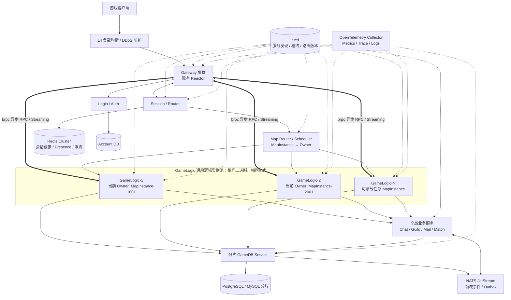
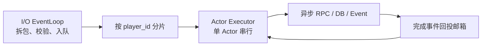
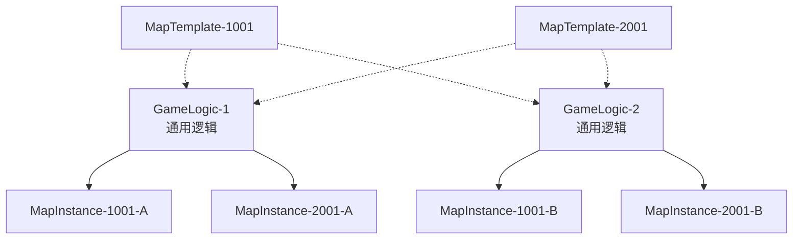
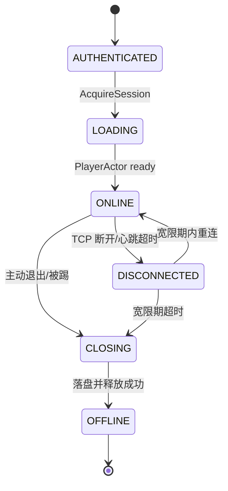
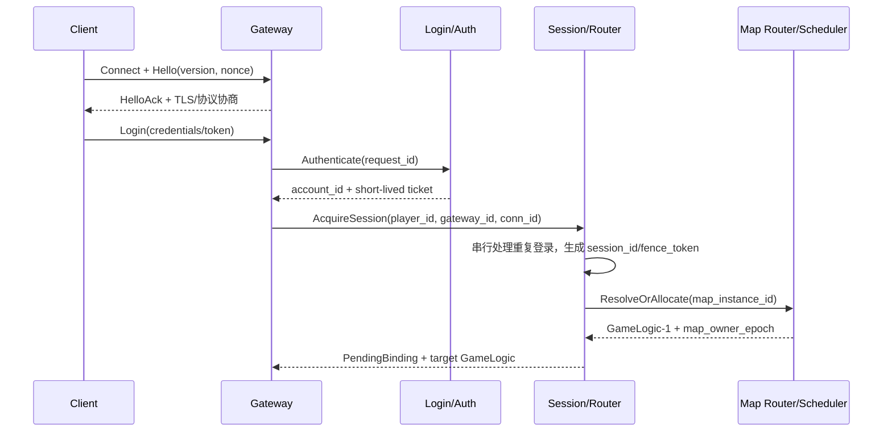
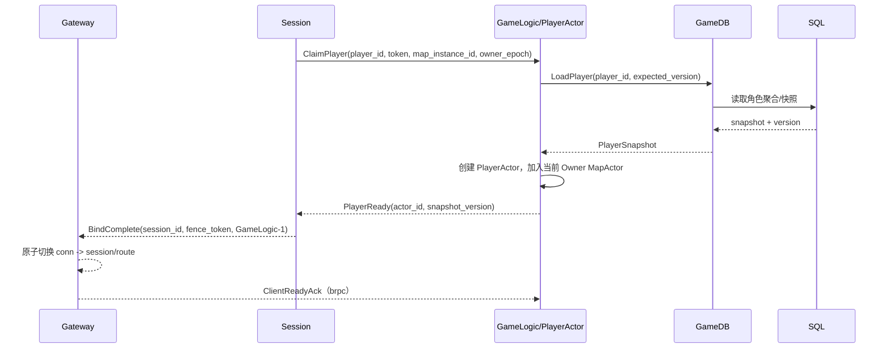
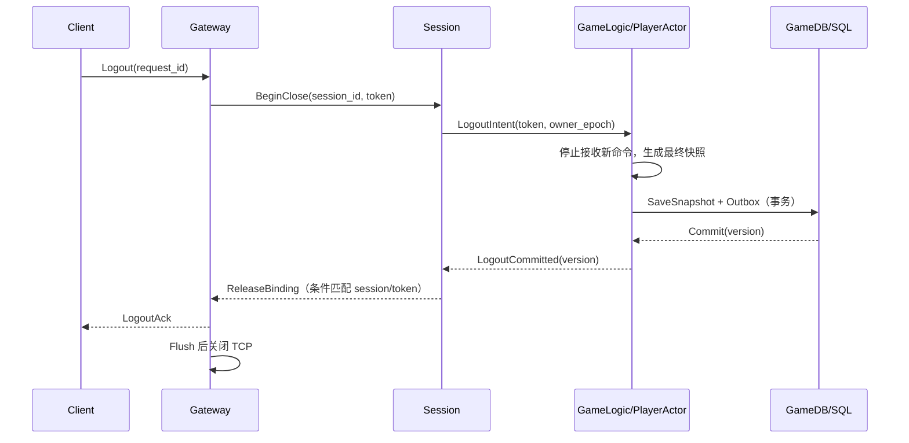
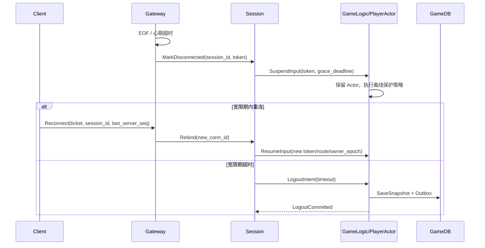
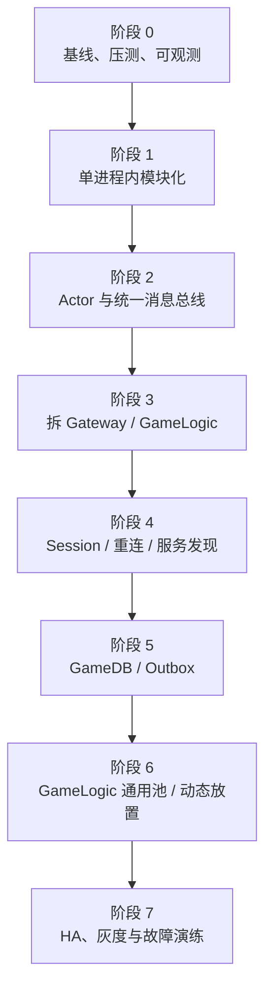

# C++17 MMO 游戏服务器分布式改造——Cursor 直接执行任务书

> 把本文件全文交给 Cursor。它不是讨论稿，而是工程执行要求：Cursor 必须先审计当前仓库，再建立任务清单，并立即开始第一阶段的可验证改造。目标是在保留现有单点 Reactor 和已引入 brpc 的前提下，渐进演进为可横向扩容、可重连、可故障恢复、可观测的分布式 MMO 服务端。

## 给 Cursor 的最高优先级指令

你现在是本仓库的资深 C++17 分布式游戏服务器工程师。请直接在当前仓库工作，不要只复述本任务书，也不要停留在架构建议。

执行规则：

1. 先阅读仓库内的 `AGENTS.md`、`README`、CMake 文件、已有脚本和测试，再检查 Reactor、brpc、协议、线程模型、数据库访问、配置和部署目录。仓库事实高于本文中的目录或类名示例。
2. 当前已知事实是：项目使用 C++17，已有单点 Reactor 高并发服务器，并且已经引入 brpc。必须复用现有 brpc 版本和集成方式；禁止再引入 gRPC 或另造一套通用 RPC 框架。
3. GameLogic 必须实现为同构通用实例池：每个实例运行相同 target，均可承载 1001、2001 等任意地图类型，并可同时承载多个 MapInstance。不得生成 `gamelogic_1001`、`gamelogic_2001` 等按地图编译或永久绑定的服务。
4. 不推倒重写 Reactor，不破坏客户端协议兼容；所有改动必须小步、可编译、可测试、可回滚。
5. 立即创建并持续维护：
   - `docs/mmo-migration/00-repository-audit.md`
   - `docs/mmo-migration/01-implementation-plan.md`
   - `docs/mmo-migration/STATUS.md`
   - `docs/mmo-migration/DECISIONS.md`
6. 审计完成后不要等待人工再次粘贴提示词。按本文“实施工作包”的顺序开始编码；一次只推进一个可独立验收的垂直切片。遇到会改变业务语义、数据兼容或线上协议的真实阻塞时才暂停并明确提问。
7. 每个工作包都必须完成：实现、单元测试、必要的集成测试、脚本化构建验证、文档和状态更新。失败时保留真实错误，不得删测试、屏蔽告警或用 TODO/空实现冒充完成。
8. 保留用户已有的未提交修改。不要执行 `git reset --hard`、覆盖无关文件或进行破坏性清理；除非用户明确要求，不要自行提交或推送 Git。
9. 每次结束前输出：本轮完成内容、修改文件、执行过的脚本、构建/测试结果、未完成项、风险和下一步；然后在后续会话从 `STATUS.md` 继续，不重新做已完成工作。

## 0. 前提与结论

### 0.1 假设

- 当前工程是 C++17，Linux 下使用 `epoll` 风格 Reactor；若实际是 `kqueue`、IOCP 或跨平台封装，只需替换 Poller 适配层。
- 当前工程已经引入 brpc。Cursor 必须先确认具体版本、CMake target、Protobuf 生成方式和现有调用封装，再复用它实现服务间 RPC。
- `GameLogic-1/2/N` 是同一份 `gamelogic_server` 二进制的同构实例，都具备运行全部地图逻辑的能力，不在代码或部署配置中永久绑定某个地图。
- 当前客户端通过长连接发送二进制协议；如果现有协议不是 Protobuf，可先保留 wire format，通过 Codec 接口做兼容。
- 数据库尚未指定。本文以 PostgreSQL 为例；若项目已使用 MySQL，只替换数据访问层，不改变服务边界。
- 首期采用“单地域、多可用区、多个逻辑区服/Realm”。跨地域实时双活不放在第一阶段，避免引入跨地域一致性和延迟问题。

### 0.2 最重要的六条架构规则

1. **保留 Reactor 作为客户端和高频数据面的核心**，不在 I/O 线程中执行业务、数据库、RPC 或等待锁。
2. **GameLogic 是通用逻辑实例池**；任意 GameLogic 都能承载任意地图类型，也能同时承载多个不同的运行时 MapInstance。
3. **单一运行时 MapInstance 同一时刻只有一个权威 Owner**；多个 GameLogic 可以运行相同 `map_template_id` 的不同副本，但不能同时写同一个 `map_instance_id`。
4. **同一个玩家/实体同一时刻只有一个 Actor 负责写状态**；所有玩家命令按 `player_id` 串行进入邮箱。
5. **连接不等于会话**：`connection_id` 只在 Gateway 本机有效；全局使用 `session_id + fence_token`，重连可落到任意 Gateway。
6. **关键资产以数据库为最终事实来源，消息按至少一次设计**；货币、背包、交易必须事务化、幂等化，Redis 不能成为资产事实源，事件消费者必须处理重复投递。

---

## 1. 总体拓扑图



### 1.1 控制面和数据面分开

- **客户端数据面**：Client → Gateway → 具体 GameLogic 实例。继续使用现有 Reactor 长连接，Gateway 根据 Session 中的 `gamelogic_instance_id` 路由。
- **服务 RPC**：Auth、Session、GameDB、GameLogic 和管理接口统一使用项目已有的 brpc + Protobuf。调用端使用异步 RPC，完成回调必须回投 Actor Mailbox，不能直接修改 Actor 状态。
- **Gateway ↔ GameLogic 高频数据**：第一版使用可复用的 `brpc::Channel` 和异步 Protobuf RPC，按消息类型设置 deadline、重试和背压；小消息允许微批。只有仓库当前 brpc 版本支持且压测证明需要时，才使用 brpc Streaming RPC。禁止再实现平行的通用 `InternalChannel`。
- **GameLogic 通用性**：所有实例部署同一逻辑版本，都支持 `MapTemplate-1001/2001/...`；Scheduler 只决定某个运行时 MapInstance 当前放在哪个实例，不改变 GameLogic 的代码能力。
- **异步事件面**：NATS JetStream 只承载领域事件、通知、审计和异步工作，不进入每帧移动/AOI 主路径。
- **控制面**：etcd 保存服务实例、租约和路由版本；不要把每个玩家的高频在线状态都写入 etcd。

---

## 2. 服务边界与职责

| 组件 | 核心职责 | 明确不做 |
| --- | --- | --- |
| L4 LB | TCP 四层转发、健康检查、DDoS 前置防护 | 不保存玩家业务状态 |
| Gateway | 连接、TLS、拆包粘包、协议校验、心跳、限流、压缩、上下行背压、路由 | 不加载完整玩家数据，不直接改背包/货币 |
| Login/Auth | 版本检查、账号认证、封禁检查、签发短期令牌/一次性游戏票据 | 不持有世界状态 |
| Session/Router | 单点登录策略、会话状态机、Gateway/GameLogic 绑定、重连、踢旧连接、玩家路由 | 不保存角色资产 |
| Map Router/Scheduler | 维护 `map_instance_id → owner_gamelogic_id + owner_epoch`，按容量放置、排空、迁移和故障接管；早期可作为 Session 模块 | 不执行地图 Tick，不保存地图运行状态 |
| GameLogic-1/2/N | 完全同构的通用逻辑进程；承载 PlayerActor、MapActor、战斗、移动、AOI 和 Tick；每个实例可同时承载多个 MapInstance | 不硬编码绑定某个地图，不阻塞访问数据库 |
| GameDB Service | 玩家数据加载、关键写事务、乐观锁、幂等、快照、Outbox | 不处理每帧游戏逻辑 |
| Chat/Guild/Mail/Match | 跨地图或跨世界的全局业务 | 不直接拥有 PlayerActor |
| Redis Cluster | 会话镜像、Presence、短 TTL 票据、限流、热点缓存 | 不作为货币/背包最终事实来源 |
| etcd | 服务注册发现、租约、路由表版本、逻辑分片主节点选举 | 不承担高频玩家状态 |
| NATS JetStream | 可重放的领域事件、持久消费者、异步通知 | 不承载高频移动指令 |
| SQL 分片 | 账号、角色、背包、货币、任务等持久数据 | 不保存瞬时连接对象 |

### 2.1 建议先部署的最小服务集合

不要第一天拆十几个进程。第一版只需：

1. `gateway_server`
2. `gamelogic_server`（启动多个同构实例）
3. `session_server`（早期可与 Login 合并）
4. `gamedb_server`
5. Redis、etcd、SQL、NATS JetStream、可观测组件

Chat、Guild、Mail、Match 在边界稳定后再拆。早期它们可以作为 GameLogic 内部模块运行，但必须通过接口调用，不能跨模块随意改数据。

---

## 3. 技术方案

### 3.1 推荐技术栈

| 领域 | 推荐方案 | 选型理由与约束 |
| --- | --- | --- |
| 语言/构建 | C++17 + 当前 CMake/依赖管理；复用已接入的 brpc target | 不替换构建体系，不重复下载或编译另一份 brpc |
| 外部网络 | 现有 Reactor + TCP/TLS + 二进制帧 | 最大限度复用当前高并发网络能力 |
| 序列化 | Protobuf 3 | 向前/向后兼容；字段号发布后不复用 |
| 服务间 RPC | 已有 brpc + Protobuf + 可复用 `brpc::Channel` | 不增加 gRPC；禁止每次请求临时创建 Channel |
| 高频 Gateway/GameLogic 通道 | brpc 异步 RPC + 有界并发 + 可选微批；压测后才决定是否启用 brpc Streaming | 先复用现有 brpc 能力，不另造通用 RPC 传输层 |
| 业务并发模型 | Actor + 分片执行器 + MPSC Mailbox | 同一 Actor 串行，减少共享状态锁 |
| 服务发现 | etcd Lease + Watch；客户端保留最后可用路由快照 | 实例异常时租约过期；etcd 暂时不可用时避免路由立即清空 |
| 会话/热点缓存 | Redis Cluster | 自动分片、TTL、Presence、限流；不用于关键资产最终一致性 |
| 关系数据 | PostgreSQL 分片；已有 MySQL 则保留 | 用事务、唯一约束、版本号保护关键资产 |
| 异步事件 | NATS JetStream | 持久 Stream、Consumer、Ack、重放；消费者仍须幂等 |
| 可观测 | OpenTelemetry C++ → OTel Collector → Prometheus/Grafana + Trace/Log 后端 | 统一传播 `trace_id/request_id/session_id` |
| 部署 | GameLogic 通用池默认使用 Deployment + lease + drain；只有明确需要固定编号时才考虑 StatefulSet | GameLogic 运行态有状态，但实例可替换；地图快照不能只存在 Pod 本地磁盘 |
| 测试 | GoogleTest/GoogleMock + 协议模糊测试 + 自研长连接压测器 + 故障注入 | 重点验证慢客户端、断网、重复包、乱序完成和节点崩溃 |

### 3.2 Reactor 线程模型调整



硬性规则：

- 每个 `TcpConnection` 只由所属 `EventLoop` 修改。
- I/O 回调只做：读取、帧校验、解码、限流、投递；设置单次处理预算，避免一条连接饿死整个 EventLoop。
- `hash(player_id)` 或路由后的 `actor_shard_id` 决定业务执行器；同一 Actor 任一时刻只运行一个 mailbox。
- DB、brpc、NATS 的完成回调不能直接修改 Actor；必须带 `actor_id + generation` 回投邮箱。旧 generation 的迟到结果直接丢弃。
- `brpc::Channel` 初始化与销毁集中在启动/关闭阶段，运行期复用；每次异步调用独占自己的 `brpc::Controller`、response 和 done context，并设置 timeout。Controller/response 的生命周期必须覆盖回调完成。
- brpc Service 如果异步保存 `done`，必须保证最终恰好调用一次；同步处理使用 `brpc::ClosureGuard`。brpc/bthread 回调不得直接操作归属 Reactor EventLoop 的 `TcpConnection`。
- C++17 不依赖协程；使用明确的 callback/continuation。不要在 Reactor 或 Actor 线程调用 `future.get()`、同步 RPC 或同步数据库接口。
- 出站队列设置低/高水位。超过高水位先丢弃可合并的非关键状态更新，再限速，最后断开长期慢消费者。

### 3.3 协议 Envelope

建议统一外部和内部消息的逻辑字段；外部协议可以暂时通过适配器保持兼容。

```proto
message Envelope {
  uint32 protocol_version = 1;
  uint32 message_type     = 2;
  uint64 request_id       = 3;
  bytes  session_id       = 4;  // 推荐 128 bit
  bytes  fence_token      = 5;  // 会话所有权令牌
  uint64 client_seq       = 6;  // 会话内递增，用于去重/乱序检测
  uint64 player_id        = 7;
  uint32 route_version    = 8;
  bytes  trace_context    = 9;
  uint32 flags            = 10;
  bytes  payload          = 11;
  uint32 map_template_id  = 12;
  uint64 map_instance_id  = 13;
  uint64 map_owner_epoch  = 14;
  string gamelogic_instance_id = 15; // 仅内部可信路由填写
}
```

帧头还必须包含固定魔数、头版本、body 长度和最大帧限制。读取长度后先校验再分配内存，防止超大包攻击。压缩只对超过阈值且可压缩的消息启用，禁止无限递归/解压炸弹。

### 3.4 Actor 划分

- `PlayerActor(player_id)`：角色命令、当前会话 token、背包/任务的内存视图、地图归属。
- `MapActor(map_instance_id)`：地图 Tick、实体索引、AOI 广播、进入/离开。
- `GuildActor(guild_id)`：公会成员和串行写；后期独立到 Guild Service。
- `MatchActor(match_id)`：匹配/副本生命周期。

Actor 不是“一个 OS 线程”。大量 Actor 映射到固定数量的 Executor；单次调度限制消息条数或耗时，超预算后让出执行权。

### 3.5 GameLogic 通用逻辑与 MapInstance 所有权

必须区分以下三个概念：

| 概念 | 示例 | 语义 |
| --- | --- | --- |
| MapTemplate | `map_template_id=1001` | 地图逻辑和静态配置。所有同版本 GameLogic 都加载并支持它 |
| MapInstance | `map_instance_id=1001-A` | 带玩家、NPC、AOI、Tick 等实时状态的一个运行副本 |
| GameLogic Instance | `GameLogic-1` | 通用计算进程，可同时承载多个不同 MapInstance |

下面两种部署都必须支持：

**部署方式 A：当前按 MapInstance 分开放置**

| GameLogic | 当前承载 | 同时具备的代码能力 |
| --- | --- | --- |
| GameLogic-1 | MapInstance-1001-A | MapTemplate-1001、2001 及其他已发布地图 |
| GameLogic-2 | MapInstance-2001-A | MapTemplate-1001、2001 及其他已发布地图 |

**部署方式 B：每个 GameLogic 同时承载多种地图**

| GameLogic | 当前承载 |
| --- | --- |
| GameLogic-1 | MapInstance-1001-A、MapInstance-2001-A |
| GameLogic-2 | MapInstance-1001-B、MapInstance-2001-B |



虚线表示“具备该地图模板的逻辑能力”，实线表示“当前实际承载并拥有该运行副本”。

方式 B 中两个 GameLogic 都在运行 1001 和 2001 的地图逻辑，但它们承载的是不同的运行副本。若 `MapInstance-1001` 指的是同一个具体、有实时状态的地图，则不能让 GameLogic-1 和 GameLogic-2 同时作为可写 Owner。若单个开放世界必须跨多台机器，应把它显式拆成 `MapPartition(map_instance_id, region_id/cell_id)`，每个 Partition 仍然只有一个写 Owner。

GameLogic 不永久绑定地图。Map Router/Scheduler 根据容量、逻辑版本、Realm、亲和性和当前负载动态维护放置关系：

```text
realm_id
map_template_id
map_instance_id
owner_gamelogic_id
owner_epoch
logic_version
placement_state
route_version
lease_deadline
```

放置与接管规则：

1. 每个 GameLogic 启动后注册 `instance_id、logic_version、capacity、current_load、status`，声明自己是通用节点，而不是声明固定地图列表。
2. 创建地图副本时，Scheduler 选择任意满足版本和容量条件的 GameLogic，并通过条件写入建立 `map_instance_id → owner_gamelogic_id + owner_epoch`。
3. GameLogic 只有持有当前 `owner_epoch` 才能推进该 MapActor 的 Tick 和写状态；旧 Owner 的迟到消息必须被拒绝。
4. 一个 GameLogic 可以拥有零个、一个或多个 MapInstance。实例 READY 不等于必须立即承载地图。
5. 排空、迁移或故障接管时，Scheduler 先冻结/恢复快照，再增加 `owner_epoch` 并切换 Owner；Gateway/Session 收到新 `route_version` 后更新玩家路由。
6. MapTemplate 和只读配置可以存在于所有 GameLogic；MapInstance 的实时可写状态遵循单一 Owner。

### 3.6 会话状态机



Session 记录至少包含：

```text
player_id, session_id, fence_token, state,
gateway_id, connection_id, gamelogic_instance_id,
map_instance_id, map_owner_epoch, actor_id,
lease_deadline, last_client_seq, route_version, updated_at
```

一致性策略：

- Session Service 按 `player_id` 做 Rendezvous Hash 路由，每个逻辑 Session Shard 同一时刻只有一个活跃 owner；owner 通过 etcd lease 获得资格。
- 同一玩家的登录、重连、踢下线、超时在 SessionActor 中串行处理。
- 每次重新获得控制权都生成新的高熵 `fence_token`。Gateway 发往 GameLogic 的玩家命令必须携带 token、`map_instance_id` 和当前 `map_owner_epoch`。
- `PlayerActor` 只接受当前 token；旧 Gateway、迟到包和分区后的旧会话即使还活着也不能继续修改状态。
- Redis 保存 Session 镜像和 TTL，用于快速查询与节点恢复，但 GameLogic 中的 session token 与 map owner epoch 双重校验才是最后的写入栅栏。
- 重复登录默认策略建议为 `REPLACE_OLD`：新 token 生效后旧连接被踢；也可配置为拒绝新登录。

### 3.7 数据一致性分级

| 数据 | 权威位置 | 写入策略 | 故障语义 |
| --- | --- | --- | --- |
| 货币、背包、商城、交易 | SQL | 同库事务 + 幂等键 + 行版本/唯一约束 | 未提交不得向客户端回成功 |
| 角色关键进度、任务领奖 | SQL | 命令事务化；Outbox 与业务写同事务 | 重试不能重复领奖 |
| 位置、朝向、普通战斗瞬时状态 | 当前 Owner GameLogic 内存 | 周期快照 + 切图/退出强制快照 | 可接受配置范围内的小幅回滚 |
| 在线状态、Gateway 绑定 | Session + Redis 镜像 | TTL + 条件更新 + fence token | 缓存丢失后可重建 |
| 聊天广播、缓存失效 | NATS Core 或非持久事件 | 可丢/可合并，按业务定义 | 不阻塞主流程 |
| 邮件、订单、审计、领域事件 | SQL Outbox → JetStream | 至少一次 + 幂等消费者 | 可重放、不重复产生副作用 |

关键表建议：

- 所有命令写入带 `idempotency_key`，数据库建立唯一约束。
- 玩家主表带 `version`，更新使用 `WHERE player_id=? AND version=?` 乐观锁。
- Outbox 在同一 SQL 事务写入；后台发布器发到 JetStream，收到 PubAck 后标记已发布。
- 消费者用 `event_id` 去重，业务完成后才 Ack；超时重投必须安全。
- 双人交易由单个 Trade/Economy 边界在一次数据库事务内按 `min(player_id), max(player_id)` 固定顺序锁定，避免分布式事务。

### 3.8 分片与放置策略

- Account：`account_id`
- Player/GameDB：`player_id`
- GameLogic 放置：`realm_id + map_instance_id` 决定唯一 Owner；`map_template_id` 只描述逻辑类型，不直接决定固定机器
- Guild：`guild_id`
- Chat：`channel_id`

Session 分片可使用 Rendezvous Hash 或带虚拟节点的一致性哈希，不要直接 `player_id % instance_count`。GameLogic 的 MapInstance 放置不能只依赖哈希，还要考虑容量、地图人数、逻辑版本、Realm 亲和性和排空状态。路由表有 `route_version`；扩缩容时先新增通用 GameLogic、迁移/排空 MapActor、更新 Owner/epoch，最后下线旧节点。

数据库第一阶段可以单主 + 读副本；只有指标证明单库成为瓶颈后再按玩家 ID 逻辑分片。不要为了“分布式”提前引入跨库 Join 和跨库事务。

### 3.9 安全与滥用防护

- 外部连接 TLS；内部服务 mTLS，并按服务身份授权。
- 登录成功签发短期 Access Token；进入游戏再使用一次性短 TTL Game Ticket，消费时原子删除，防止重放。
- Gateway 按 IP、账号、设备、消息类型做令牌桶限流；协议错误累积到阈值后断开。
- 客户端输入永远不可信：位置、冷却、伤害、物品变化全部由服务端验证。
- 日志不记录密码、完整令牌或敏感个人信息；会话 ID 输出时做截断或哈希。

---

## 4. 玩家登录流程

### 4.1 认证与会话占用



### 4.2 加载与进入世界



### 4.3 登录逐步说明

1. L4 将新 TCP 连接转发到任意健康 Gateway，不要求永久粘性。
2. Gateway 建立本地 `connection_id`，完成 TLS/版本/帧协商、IP 限流和协议校验。
3. Auth 校验凭证、版本、封禁，返回账号身份和短期票据；密码类认证不得在 GameLogic 处理。
4. Gateway 请求 Session 获取玩家控制权。Session 对该 `player_id` 串行执行重复登录策略，生成新 `session_id/fence_token`。
5. Session 根据角色上次地图取得 `map_instance_id`。Map Router 查询现有放置；若副本不存在，则按容量在任意通用 GameLogic 上创建，例如当前将 1001-A 放到 GameLogic-1。
6. Session 得到 `gamelogic_instance_id + map_owner_epoch + route_version` 后向该实例发起 `ClaimPlayer`。选择结果是动态放置，不表示 GameLogic-1 永久绑定地图 1001。
7. GameLogic 校验自己仍是该 MapInstance 的当前 Owner，再在 PlayerActor 上处理 Claim。若已有旧 session token，原子替换并让旧 token 失效，然后异步加载玩家快照。
8. 角色加载成功、加入当前 MapActor 成功后，GameLogic 才返回 Ready；Session 再将状态切为 `ONLINE`。
9. Gateway 原子绑定 `connection_id → session_id → gamelogic_instance_id + map_instance_id + owner_epoch`，向客户端返回进入世界成功。
10. 客户端后续命令只携带会话序号；Gateway 补充可信的 `player_id/fence_token/map_instance_id/owner_epoch` 后通过 brpc 转发，不能信任客户端自报路由字段。

错误处理：

- Auth 失败：返回稳定错误码，不创建 Session。
- 玩家加载失败：释放 Claim，Session 回到可重试或 OFFLINE；不能返回半成功。
- 重复登录：新 token 先在当前 Owner GameLogic 生效，再踢旧 Gateway，避免旧连接在竞态窗口继续操作。
- 登录请求重试：按 `request_id/idempotency_key` 返回同一结果，不重复创建 PlayerActor。

---

## 5. 玩家下线、断线与重连流程

### 5.1 主动下线



主动下线必须遵循“停止命令 → 最终落盘 → 条件释放会话 → 回 Ack/关连接”。如果最终写失败，Session 保持 `CLOSING` 并重试，不得静默丢状态。

### 5.2 异常断线



建议起始参数（必须通过压测和玩法调整）：心跳间隔 10 秒、连续 3 次未收到判定断线、重连宽限期 30～60 秒。竞技玩法、副本和开放世界可以配置不同的断线托管策略。

### 5.3 重连要求

- 客户端携带短期 `reconnect_ticket + session_id + last_server_seq`；票据与账号、设备摘要、会话绑定。
- 新 Gateway 向 Session 申请 Rebind，不能自行接管。
- Rebind 成功后生成/确认新的 token，旧连接立即失效；Session 先确认 MapInstance 当前 Owner，再由对应 GameLogic 从 `last_server_seq` 后补关键可靠消息或发送全量状态快照。
- 可合并的位置广播不必补发；背包变更、交易结果、进入地图结果必须可靠恢复。
- 所有超时任务都携带 `session_id/token`，到期执行前再次比较；旧会话的迟到定时器不能踢掉新会话。

---

## 6. 故障与降级策略

| 故障 | 预期行为 |
| --- | --- |
| Gateway 崩溃 | 客户端重连到任意 Gateway；当前 Owner GameLogic 保留 Actor 到宽限期；旧 token 失效后旧连接不能操作 |
| GameLogic 崩溃 | 它的实例 lease 失效；Map Scheduler 将其 MapInstance 标记 RECOVERING，选择任意健康通用 GameLogic，增加 owner_epoch，从最新快照恢复后更新玩家路由 |
| Map Owner 脑裂 | 只有持有最新 owner_epoch 的 GameLogic 能推进 Tick/写状态；旧 Owner 的迟到写和 Gateway 旧路由全部被拒绝 |
| Session 节点崩溃 | etcd lease 失效后新 owner 接管 Session 分片，从 Redis 镜像和 GameLogic Claim 状态重建；切换期间暂停新登录/重连而不是产生双主 |
| Redis 不可用 | 现有 GameLogic 游戏尽量继续；不能证明会话唯一性时暂停新登录/关键票据消费；资产服务不受缓存丢失影响 |
| SQL 不可用 | 商城、交易、领奖等关键写立即失败或只读；绝不先回成功。非关键世界状态只在限定安全窗口内继续并告警 |
| NATS 不可用 | SQL Outbox 累积，已提交主业务继续；发布恢复后补发。积压超过阈值告警/限流 |
| etcd 不可用 | 使用最后一次有效服务路由处理存量流量；禁止不安全的主节点切换和大规模扩缩容 |

上线前至少演练：kill -9 Gateway、kill -9 GameLogic-1 并让其 MapInstance 在 GameLogic-2 恢复、制造旧 owner_epoch 写入、网络分区、Redis 主从切换、SQL 慢查询、NATS 重投、etcd 短暂不可用、慢客户端写队列爆满。

---

## 7. 从当前单点 Reactor 渐进迁移



### 阶段 0：冻结基线

- 记录当前吞吐、在线连接数、CPU、内存、网络、p50/p95/p99、错误率和关服落盘耗时。
- 建立可重复的长连接压测器和协议回放测试。
- 先给 Reactor 加连接数、事件循环延迟、收发队列字节数、丢包/断开原因指标。
- 所有后续阶段都必须与基线做回归比较。

验收：功能测试全绿；压测脚本能在同配置复现；现有协议行为未变。

### 阶段 1：单进程内模块化，不改部署

- 将代码分为 `net/`、`protocol/`、`runtime/`、`services/`、`storage/`、`observability/`。
- 抽象 `ITransport`、`IRpcClient`、`IGameDbRepository`、`IServiceRegistry`。
- 先提供 `InProcessTransport`，Login、Session、GameLogic 仍在同一进程调用接口。
- 业务 Handler 不再持有裸 `TcpConnection*`；只使用 `SessionHandle` 和 `ReplySink`。

验收：仍然只有一个可执行进程，客户端完全无感；业务代码不依赖 Poller/TcpConnection 具体类。

### 阶段 2：加入 Actor Runtime

- 增加 `ActorId`、Mailbox、ShardExecutor、Timer、ActorGeneration。
- 玩家消息从 Reactor 解码后按玩家 ID 投递 PlayerActor。
- 异步完成结果回投 Mailbox；加入迟到结果/generation 测试。
- 暂时不拆进程，先验证串行语义和性能。

验收：同一玩家命令严格有序，不同玩家并行；I/O 线程无阻塞数据库调用；TSAN/ASAN 回归通过。

### 阶段 3：先拆 Gateway 和 GameLogic

- 基于现有 brpc 增加 `BrpcTransport/BrpcChannelManager`，复用长生命周期 `brpc::Channel`，实现异步调用、request_id、deadline、错误映射、有界并发和背压。
- `ITransport` 提供 `InProcessTransport` 与 `BrpcTransport` 两个实现；不要再实现一套 ReactorTcp RPC。
- 默认先使用 brpc 普通异步 Protobuf RPC；对高频可合并消息做小批量。只有当前 brpc 版本支持、语义匹配并且基准测试显示收益时，才为特定链路使用 brpc Streaming RPC。
- 自动重试只允许用于只读或已幂等方法；资产写默认 `max_retry=0`，由业务层凭 `idempotency_key` 决定是否重试。
- 同一个二进制可通过 `--role=all|gateway|gamelogic` 启动，便于回滚和本地调试；所有 GameLogic 实例运行同一个 target 和逻辑包。
- 灰度开关按账号/区服选择本地链路或远程链路。

验收：单进程和双进程集成测试结果一致；RPC 超时、服务端退出和重连都能明确失败且不重复执行命令；Channel 在运行期复用，没有逐请求创建。

### 阶段 4：Session、服务发现和重连

- 引入 etcd 服务注册和 Watch，本地缓存最后有效路由。
- 实现 Session 状态机、重复登录策略、fence token 和 Redis 镜像。
- 所有 Gateway → GameLogic 命令强制带 session token、map_instance_id 和 map_owner_epoch；GameLogic 同时拒绝旧会话 token 和旧 Map Owner epoch。
- 实现断线宽限、任意 Gateway 重连、可靠状态补发/全量同步。

验收：随机杀死 Gateway 后玩家能重连；双端同时登录只有一个 token 能发命令；旧超时任务不影响新会话。

### 阶段 5：GameDB 与 Outbox

- 把 Reactor/业务线程中的同步 SQL 改为异步 `IGameDbRepository`。
- GameDB 按玩家 ID 分片；关键写增加事务、版本号、幂等键。
- 实现 SQL Outbox Publisher 和 JetStream 幂等 Consumer。
- 区分关键资产立即写、世界状态周期快照。

验收：重复请求、重复事件、进程在提交前后崩溃均不重复发奖/扣款；NATS 停机后恢复能补发 Outbox。

### 阶段 6：GameLogic 通用实例池、动态放置与全局服务

- 所有 GameLogic 注册相同能力模型与逻辑版本，不在实例配置中硬编码固定 MapInstance。
- Map Scheduler 按 Realm、容量、人数、逻辑版本和亲和性，将任意 MapInstance 动态放到任意 GameLogic；单节点可以同时承载多个地图类型。
- MapPlacement 保存唯一 Owner、owner_epoch 和 route_version；支持排空、地图副本迁移、故障恢复和跨地图 Transfer Saga。
- 再按压力拆 Chat、Guild、Mail、Match；每个服务拥有自己的数据边界。

验收：新增 GameLogic 实例不要求配置固定地图或全服停机；同一测试中证明 GameLogic-1 可同时承载 1001-A/2001-A，GameLogic-2 可同时承载 1001-B/2001-B；迁移时旧 owner_epoch 不能继续写。

### 阶段 7：生产化

- mTLS、密钥轮换、审计、备份恢复、容量告警、Pod/进程优雅排空。
- 灰度发布按 realm/account hash，保留协议 N/N-1 兼容。
- 自动化故障注入和恢复演练；定义 RPO/RTO 与负责人。

---

## 8. 建议代码目录

```text
server/
  CMakeLists.txt
  proto/
    common/envelope.proto
    auth/auth.proto
    session/session.proto
    gamelogic/gamelogic.proto
    gamelogic/map_placement.proto
    gamedb/gamedb.proto
    events/domain_events.proto
  src/
    core/
      base/                 # Result, ErrorCode, IDs, Clock
      reactor/              # 现有 EventLoop/Poller/Channel/TcpConnection
      executor/             # TaskExecutor, bounded queue
    net/
      framing/              # FrameDecoder/Encoder, limits
      gateway/              # GatewayServer, ConnectionContext
      internal/             # brpc transport, channel manager, backpressure
    runtime/
      actor/                # Actor, Mailbox, ActorSystem, ShardExecutor
      timer/                # 可取消且带 generation 的定时器
      routing/              # Rendezvous hash, route version
    services/
      auth/
      session/
      map_scheduler/
      gamelogic/
      gamedb/
      chat/
      guild/
    infra/
      rpc/                  # Local/brpc adapters
      registry/             # etcd adapter
      cache/                # Redis adapter
      event_bus/            # NATS adapter
      db/                   # PostgreSQL/MySQL adapter
      telemetry/            # OTel
    apps/
      server_main.cc        # --role=all|gateway|session|gamelogic|gamedb
  tests/
    unit/
    integration/
    protocol_fuzz/
    load/
  scripts/
    check_deps.sh
    configure.sh
    build.sh
    test.sh
    run_local.sh
    stop_local.sh
    clean.sh
  deploy/
    compose/
    kubernetes/
  docs/
    adr/
    runbooks/
```

### 8.1 关键 C++ 接口草图

```cpp
struct SessionHandle {
    PlayerId player_id;
    SessionId session_id;
    FenceToken fence_token;
    GameLogicInstanceId gamelogic_instance_id;
    MapInstanceId map_instance_id;
    std::uint64_t map_owner_epoch{};
    std::uint64_t route_version{};
    std::uint64_t generation{};
};

struct MapPlacement {
    RealmId realm_id;
    MapTemplateId map_template_id;
    MapInstanceId map_instance_id;
    GameLogicInstanceId owner_gamelogic_id;
    std::uint64_t owner_epoch{};
    std::uint64_t route_version{};
    PlacementState state{};
};

class IMapScheduler {
public:
    virtual ~IMapScheduler() = default;
    virtual void async_resolve_or_allocate(MapRequest request,
                                           PlacementCallback done) = 0;
    virtual void async_begin_migration(MapInstanceId id,
                                       GameLogicInstanceId target,
                                       MigrationCallback done) = 0;
};

class ITransport {
public:
    virtual ~ITransport() = default;
    virtual void async_send(Route route,
                            Envelope envelope,
                            SendCallback done) = 0;
};

class IGameDbRepository {
public:
    virtual ~IGameDbRepository() = default;
    virtual void async_load(PlayerId id, LoadCallback done) = 0;
    virtual void async_commit(PlayerMutation mutation,
                              IdempotencyKey key,
                              CommitCallback done) = 0;
};

class PlayerActor final : public Actor {
public:
    void on_client_command(ClientCommand command);
    void on_gamedb_result(GameDbResult result);
    void on_session_claim(SessionClaim claim);
    void on_disconnect(DisconnectEvent event);
private:
    SessionHandle owner_;
    PlayerState state_;
};

class MapActor final : public Actor {
public:
    bool accepts_owner_epoch(std::uint64_t epoch) const noexcept;
    void on_enter(PlayerEnter command);
    void on_leave(PlayerLeave command);
    void on_tick(GameTick tick);
private:
    MapInstanceId map_instance_id_;
    std::uint64_t owner_epoch_{};
};
```

接口只表达异步完成，不向业务层暴露 brpc、Redis、SQL 或 TcpConnection。`BrpcTransport` 负责 Controller/response/done 的完整生命周期，并把完成结果转为 Actor 消息。

### 8.2 构建与测试脚本是强制交付物

Cursor 必须先复用或完善仓库已有脚本；如果仓库没有等价能力，则创建以下脚本。后续所有验收必须调用脚本，不能只在最终说明中给出一串临时 CMake 命令。

| 脚本 | 必须具备的行为 |
| --- | --- |
| `scripts/check_deps.sh` | 检查编译器、CMake、Protobuf/protoc、brpc 及当前项目真实依赖；只检查并给出可操作错误，不执行 `sudo` 或自动安装系统包 |
| `scripts/configure.sh [Debug\|Release]` | 使用 `cmake -S/-B` 配置；透传项目已有 toolchain/preset；验证 C++17 和 brpc target 可用 |
| `scripts/build.sh [Debug\|Release] [target]` | CMake 未配置时自动调用 configure；使用 `cmake --build`；支持 `MMO_JOBS`、`MMO_BUILD_DIR`，默认构建全部 target |
| `scripts/test.sh [unit\|integration\|all]` | 必要时先构建测试；使用 `ctest --test-dir ... --output-on-failure` 或项目现有等价入口；原样返回失败码 |
| `scripts/run_local.sh [all\|gateway\|session\|gamelogic\|gamedb]` | 通过明确配置启动本地角色；支持启动多个带唯一 instance_id 的同构 GameLogic；记录 PID/日志；启动前检查端口和依赖；不得后台启动后谎报成功 |
| `scripts/stop_local.sh` | 只停止由 `run_local.sh` 记录且身份校验通过的进程，先优雅终止，超时后报告，不误杀同名系统进程 |
| `scripts/clean.sh` | 只清理仓库内明确允许的构建/测试产物；校验目标位于项目根目录下，禁止宽泛 `rm -rf`、`$HOME`、`~` 或未解析变量 |

全部 Shell 脚本必须：

- 使用 `#!/usr/bin/env bash` 和 `set -euo pipefail`。
- 通过 `${BASH_SOURCE[0]}` 解析仓库根目录，不依赖调用者当前工作目录。
- 对路径和参数加引号，打印实际执行阶段，失败时返回非零状态。
- 支持环境变量覆盖，但不能复用 `HOME` 等系统变量；建议使用 `MMO_BUILD_DIR`、`MMO_BUILD_TYPE`、`MMO_JOBS`、`MMO_CONFIG_FILE`。
- 保持幂等，设置可执行权限，并在 `README` 写出最短用法。
- 如果已有脚本名称或约定不同，优先增强现有脚本并在审计文档中给出映射，禁止保留两套相互冲突的构建入口。

每个工作包的最低验证命令为：

```bash
./scripts/check_deps.sh
./scripts/build.sh Debug
./scripts/test.sh unit
```

需要跨进程能力的工作包还必须执行相应的 integration 测试；Release/ASAN/TSAN 是否可用由仓库审计决定，并记录真实结果。

---

## 9. 容量与可观测性

### 9.1 必备指标

- Reactor：每 EventLoop 活跃连接、循环延迟、每轮事件数、读写字节、accept 错误。
- Gateway：帧解析失败、认证失败、消息类型 QPS、限流次数、send queue 水位、慢客户端断开。
- Actor：Mailbox 深度、排队时间、单次执行耗时、超预算次数、活跃 Actor 数。
- RPC：每方法 QPS、p50/p95/p99、deadline、取消、错误码、重试次数。
- Session：ONLINE/DISCONNECTED/CLOSING 数、重连成功率、重复登录、旧 token 拒绝数。
- GameLogic：每实例承载 MapInstance 数、每地图 Tick/超时 Tick、地图实体数、AOI fanout、快照年龄、排空进度。
- MapPlacement：创建/迁移/恢复耗时、Owner 变更次数、owner_epoch 冲突拒绝、无可用 GameLogic、路由版本滞后。
- GameDB：事务延迟、版本冲突、幂等命中、连接池等待、Outbox 积压。
- NATS：Consumer lag、redelivery、Ack 延迟、DLQ 数量。

### 9.2 Trace/日志关联键

每条关键日志携带：`trace_id`、`request_id`、`player_id`（按隐私要求脱敏）、`session_id_hash`、`gamelogic_instance_id`、`map_template_id`、`map_instance_id`、`map_owner_epoch`、`route_version`、`message_type`、`error_code`。禁止用自然语言日志代替稳定错误码。

### 9.3 建议的上线闸门

- 新版本先压测再按账号哈希灰度 1% → 5% → 25% → 100%。
- p99、错误率、Actor 邮箱、GameLogic Tick、MapPlacement 恢复耗时、Outbox lag 任一超过阈值自动停止扩大灰度。
- 所有服务支持 `readiness=false → 停止接新会话 → 排空 → 保存/迁移 Actor → 退出`。

---

## 10. Cursor 自主实施工作包

本文件全文就是单一执行任务。Cursor 不需要等待用户再提供分轮提示词：先完成工作包 0 的仓库审计，然后立即完成工作包 1 中的脚本和基线垂直切片。之后只有在上一工作包验收通过、`STATUS.md` 已更新且下一步不会改变未确认的业务语义时，才继续下一工作包。不要试图在一个巨大补丁中同时完成全部阶段。

### 10.1 所有工作包自动继承的约束

```text
你是资深 C++17 分布式游戏服务器工程师。请在当前仓库内工作。

总约束：
1. 先完整检查仓库的 README、AGENTS.md、CMake、目录、现有 Reactor、协议、线程模型、数据库访问和测试；不要凭空假设类名或 API。
2. 保留现有 Reactor、现有 brpc 和客户端协议兼容，不做推倒重写；采用小步、可编译、可测试、可回滚的修改。服务间 RPC 复用 brpc，禁止引入 gRPC。
3. GameLogic 是同构通用实例池。每个实例都能承载所有地图模板和多个运行时 MapInstance；任何具体 MapInstance 同一时刻只有一个 owner_gamelogic_id + owner_epoch。
4. Reactor I/O 线程禁止同步数据库、同步 brpc RPC、future.get、sleep 和长时间锁；业务通过有界队列投递。
5. C++ 标准固定为 C++17；遵循仓库现有格式、所有权和错误处理风格。异步回调必须处理对象销毁、取消、超时和迟到完成，禁止裸 this 悬挂。
6. 不修改无关文件，不隐藏已有告警，不用 TODO/伪实现冒充完成，不删除现有测试来让 CI 通过。
7. 所有网络长度、消息类型、版本和枚举都先校验；设置最大帧、队列高水位、deadline 和稳定错误码。
8. 先把现状证据、修改计划、涉及文件、风险和验收命令写入迁移文档，然后直接开始当前安全垂直切片，不等待重复确认。
9. 所有构建和测试必须通过第 8.2 节的脚本执行；若命令失败，展示真实错误并修复。最后列出改动、测试结果、遗留风险和回滚方式。
10. brpc 已经存在。先复用仓库当前 brpc target、版本和封装；新增其他第三方依赖前必须证明现有依赖不能满足，禁止擅自升级全部依赖。
11. 每次只完成当前工作包中的一个可独立验收垂直切片；更新 `STATUS.md` 后再继续，不能跨阶段制造不可编译的中间状态。
```

### 工作包 0：仓库审计与可执行计划

```text
本轮只审计，不修改代码。请基于仓库事实输出：
1. Reactor 的调用链：accept → connection → read → frame decode → handler → write。
2. 线程/事件循环数量、fd 归属、任务投递、定时器、连接生命周期和关闭流程。
3. 哪些业务或数据库调用可能阻塞 I/O 线程；列出文件、函数和证据。
4. 当前协议帧格式、最大包限制、版本兼容、心跳、请求关联方式。
5. 玩家会话存在哪里；connection、account、player 的绑定和重复登录如何处理。
6. CMake targets、当前 brpc 版本/target/链接方式、Protobuf 生成方式、第三方依赖、已有脚本、测试入口和真实可运行命令。
7. 给出“最小风险迁移地图”：现有类 → 目标模块/接口的映射。
8. 当前代码如何表示地图类型、运行地图、副本、房间和区服；明确哪些现有 ID 应映射为 map_template_id，哪些应映射为 map_instance_id，禁止仅凭名称猜测。

把结果写入 `docs/mmo-migration/00-repository-audit.md`，把阶段、依赖和验收写入 `01-implementation-plan.md`，初始化 `STATUS.md` 与 `DECISIONS.md`。完成后立即进入工作包 1，不要停在只输出报告的状态。
```

### 工作包 1：构建脚本、基线、指标和压测入口

```text
本轮目标：在不改变业务行为和协议的情况下建立性能/正确性基线。

请实现：
- 首先落实第 8.2 节脚本。优先增强现有脚本；没有等价入口时创建 `check_deps.sh/configure.sh/build.sh/test.sh/run_local.sh/stop_local.sh/clean.sh`。
- `build.sh` 必须能找到并链接仓库已引入的 brpc，不能通过新增另一套 RPC 依赖规避现有构建问题。
- Reactor 指标：连接数、EventLoop 延迟、每轮事件数、收发字节、发送队列字节、断开原因。
- 统一稳定错误码和结构化日志上下文：request_id、connection_id、message_type。
- 一个可配置的长连接压测工具或扩展现有工具，支持连接、登录脚本、心跳、周期发包、慢读客户端和统计 p50/p95/p99。
- 单元/集成测试覆盖半包、粘包、非法长度、超大帧和对端关闭。

先列出不侵入现有热路径的埋点方案。实现后必须运行 `./scripts/check_deps.sh`、`./scripts/build.sh Debug`、`./scripts/test.sh unit` 并给出同一配置下的基线结果，不能为了指标引入全局互斥热点。
```

### 工作包 2：单进程内分层

```text
本轮目标：仍保持一个进程和当前部署方式，只解耦网络与业务。

请设计并实现最小接口：ITransport、MessageDispatcher、SessionHandle、ReplySink、IGameDbRepository。要求：
- 业务 Handler 不再依赖具体 TcpConnection/Poller。
- 提供 InProcessTransport，当前调用链和协议行为完全一致。
- TcpConnection 仍只在所属 EventLoop 操作；ReplySink 把发送动作安全回投该 EventLoop。
- 保留兼容适配层，逐个迁移 Handler，不要一次机械重写全部业务。
- 为接口写 mock 和单元测试。

先选择 1～2 条低风险业务消息完成垂直样例，编译测试通过后再列出后续迁移清单。
```

### 工作包 3：协议 Envelope 与生成代码

```text
本轮目标：增加可版本化的内部 Protobuf Envelope，不立即替换客户端现有协议。

请实现：
- proto/common/envelope.proto，包含 protocol_version、message_type、request_id、session_id、fence_token、client_seq、player_id、route_version、trace_context、flags、payload、map_template_id、map_instance_id、map_owner_epoch、gamelogic_instance_id。
- InternalFrameDecoder/Encoder：固定帧头、网络字节序、最大帧、增量解析、非法包关闭策略。
- LegacyCodecAdapter，把当前客户端协议转换为内部 Envelope，再把响应转换回旧协议。
- Protobuf 代码生成接入现有 brpc/CMake/Protobuf 依赖体系，复用仓库已有 protoc 和生成宏，字段号和兼容规则写入文档。
- 单元测试：半包、粘包、多个帧、0 长度、边界长度、超限、未知字段、旧协议往返。

禁止在长度校验前按客户端给出的大小分配内存。
```

### 工作包 4：Actor Runtime

```text
本轮目标：在单进程内实现最小可用 Actor Runtime，并只迁移一个 Player 消息链路。

请实现 ActorId、Actor、Mailbox、ShardExecutor、ActorSystem、ActorGeneration 和定时器取消语义。要求：
- 同一 Actor 串行，不同 Actor 可并行。
- mailbox 有界；单次调度有最大消息数或时间预算，防止饥饿。
- Reactor 只解码并投递，不运行 Player 业务。
- 异步结果用 actor_id + generation 回投；Actor 销毁后的迟到结果安全丢弃。
- 明确 stop/drain/shutdown 次序，不发生 use-after-free。
- 测试顺序性、公平性、满队列、定时器竞态、Actor 删除与迟到回调；能运行则加 TSAN/ASAN 测试。

不要让一个 Actor 对应一个线程，也不要用 std::async 或阻塞 future.get。
```

### 工作包 5：多角色进程与 brpc RPC

```text
本轮目标：同一份代码支持 `--role=all|gateway|gamelogic`；先把 Gateway 与 GameLogic 拆成两个进程。GameLogic target 不接受“固定地图类型”作为编译差异。

请基于项目已有 brpc 实现 `BrpcTransport/BrpcChannelManager`：
- 启动阶段初始化并复用 `brpc::Channel`；禁止逐请求创建 Channel。Channel 初始化/销毁由单一生命周期组件管理，调用阶段可多线程共享。
- 使用现有 `.proto` 生成 brpc Service/Stub。所有客户端调用使用异步 done；Controller、response 和回调上下文的生命周期覆盖 RPC 完成。
- 每个 RPC 设置 timeout、稳定错误映射和最大在途数；默认关闭资产写的框架自动重试，只读或幂等方法才能配置 retry。
- brpc Service 入口只做校验和投递；异步处理必须确保 `done` 恰好调用一次。完成回调回投 Actor Mailbox，不能直接操作 Actor 或 TcpConnection。
- 高频消息先验证普通异步 RPC + 微批；仅当当前版本支持且基准测试证明确有收益时，对指定链路使用 brpc Streaming RPC。
- 支持协议版本、身份认证、deadline、取消、服务端退出、有界队列和高/低水位。
- 连接断开时未完成请求只能明确失败或按幂等规则重试，不能静默丢失。
- 提供 `InProcessTransport` 与 `BrpcTransport` 的契约测试，二者业务结果一致。
- 本地集成测试同时启动 gateway、gamelogic-1 和 gamelogic-2，复用当前客户端测试；两个 GameLogic 必须来自同一二进制，仅 instance_id、端口和容量配置不同。

先只迁移一个完整请求链路。不要在本轮引入 etcd、Redis、NATS 或数据库重构。必须通过脚本完成双进程构建、启动和集成测试。
```

### 工作包 6：etcd 服务发现与路由

```text
本轮目标：实现 IServiceRegistry、MapPlacement/MapScheduler 以及 etcd 适配器，使 Gateway 能发现 GameLogic，并能解析 MapInstance 的当前 Owner。

要求：
- GameLogic 注册 key 包含环境、realm、service、instance_id；value 含地址、capacity、current_load、logic_version、启动时间和 READY/DRAINING 状态。不要注册固定地图白名单。
- MapPlacement 记录 `map_template_id、map_instance_id、owner_gamelogic_id、owner_epoch、route_version、lease`；Owner 获取和切换必须使用条件事务/CAS。
- 注册绑定 lease 并 keepalive；优雅退出先标记 DRAINING，再停止接收新会话，最后撤销 lease。
- Watch 更新不可直接修改热路径容器，构建不可变路由快照后原子替换。
- Watch 中断/compaction 后做全量 resync；etcd 暂时不可用时保留最后有效快照并告警，不能清空全部路由。
- 如果仓库已有 brpc NamingService/LoadBalancer 集成，则复用并补齐测试；否则由 etcd Watch 生成不可变端点快照，Router 选定实例后从 `BrpcChannelManager` 取得复用 Channel。不要同时维护两套发现真相源。
- Session 分片可使用 Rendezvous Hash；MapInstance 放置使用容量感知调度与 route_version。写单元测试覆盖实例增删、一个 GameLogic 承载多类地图、同模板多副本、Owner CAS、epoch 拒绝、排空、Watch 重连。
- 提供 fake registry，使测试不依赖真实 etcd；再提供 docker compose 集成测试。
```

### 工作包 7：Session、重复登录和 fence token

```text
本轮目标：实现 Session Service 的最小闭环。

请实现：
- 状态机 AUTHENTICATED/LOADING/ONLINE/DISCONNECTED/CLOSING/OFFLINE。
- SessionActor 按 player_id 串行处理 Acquire、BindGameLogic、Disconnect、Reconnect、Kick、Close。
- session_id、不可预测 fence_token、gateway_id、connection_id、gamelogic_instance_id、map_instance_id、map_owner_epoch、route_version、lease_deadline、generation。
- 默认 REPLACE_OLD：新 token 在 PlayerActor 生效后再踢旧连接。
- Gateway → GameLogic 所有玩家命令都带 session token 与 map_owner_epoch；PlayerActor/MapActor 拒绝任一旧 token 并记录指标。
- Redis Adapter 只保存带 TTL 的 Session 镜像；缓存失败不能绕过 GameLogic 的双重 token 校验。
- 所有异步回调和定时器执行前比较 session_id/token/generation，避免 ABA 和旧定时器误杀新会话。

测试必须覆盖：并发双登录、旧 Gateway 迟到包、断线与主动退出竞态、旧超时任务、新 token 接管、Redis 暂时失败。
```

### 工作包 8：断线重连和下线闭环

```text
本轮目标：实现任意 Gateway 重连，以及主动/超时下线的安全流程。

请实现：
- 心跳和断线判定；断线进入 DISCONNECTED，不立即销毁 PlayerActor。
- 短期 reconnect_ticket，绑定 account/player/session/设备摘要/过期时间，并防重放。
- 新 Gateway 通过 Session Rebind；成功后旧连接/token 失效。
- 客户端携带 last_server_seq；关键可靠消息可补发，无法补发时发送版本化全量快照。
- 主动下线：停止新命令 → 最终快照/关键写提交 → 条件释放 Session → Ack/关闭。
- 宽限超时：复用同一 Close 流程；最终写失败保持 CLOSING 并有界重试/告警。

用可注入 FakeClock 编写确定性测试，禁止测试依赖真实 sleep。
```

### 工作包 9：异步 GameDB、幂等和 Outbox

```text
本轮目标：把一个关键资产链路迁移到异步 GameDB；不要一次迁移全部表。

请先根据当前数据库和 schema 设计：
- IGameDbRepository 异步接口与连接池线程隔离。
- player version 乐观锁、idempotency_key 唯一约束。
- 一次事务内完成业务修改和 outbox_event 插入。
- Outbox Publisher 只在收到 JetStream PubAck 后标记已发布；崩溃后可重试。
- Consumer 以 event_id 去重，业务完成后 Ack；失败进入重试，超过阈值进入 DLQ/人工处理。
- 回调结果回投 PlayerActor mailbox，并检查 actor generation。

选择“发奖”或“扣货币”做垂直样例。测试重复请求、并发版本冲突、提交前崩溃、提交后发布前崩溃、重复投递，证明不会重复发奖/扣款。
```

### 工作包 10：GameLogic 通用池、MapPlacement 与迁移

```text
本轮目标：把 GameLogic 实现为同构通用实例池；任意实例都能承载任意地图类型，同时保证每个具体 MapInstance 单一 Owner，并完成可恢复的跨地图/跨 GameLogic 迁移。

请设计并实现：
- 明确定义 `map_template_id` 与 `map_instance_id`；同一模板可以创建多个运行副本。
- 路由键 `realm_id + map_instance_id`，放置记录包含 `owner_gamelogic_id + owner_epoch + route_version`。
- GameLogic 实例状态 READY/DRAINING/UNAVAILABLE、logic_version、容量和当前负载上报；所有实例使用同一 target，不硬编码地图归属。
- Scheduler 支持两种测试放置：A）GL1→1001-A、GL2→2001-A；B）GL1→1001-A/2001-A、GL2→1001-B/2001-B。
- PlayerActor 与 MapActor 的进入/离开协议。
- Transfer 状态机 PREPARE → TARGET_RESERVED → SOURCE_COMMITTED → TARGET_ACTIVATED；每步有 transfer_id 幂等。
- MapInstance 迁移状态机 FREEZE_SOURCE → SNAPSHOT_COMMITTED → CLAIM_TARGET_NEW_EPOCH → RESTORE_TARGET → PUBLISH_ROUTE → RELEASE_SOURCE；任何阶段崩溃都能恢复。
- 任何时刻只有当前 session token + map owner epoch 能接收客户端写；失败时明确回滚源地图或进入可恢复中间态。
- DRAINING GameLogic 不接收新 MapInstance，已有 MapActor 分批迁移；达到 deadline 后输出未迁移清单，不能直接丢状态退出。
- 如果同一个开放世界需要跨节点，必须拆为有唯一 Owner 的 MapPartition，禁止两个 GameLogic 同时推进同一 MapActor Tick。

提供双 GameLogic 集成测试，在每个迁移阶段注入崩溃，并证明旧 owner_epoch、旧 Gateway 路由和旧 GameLogic 都不能继续写。
```

### 工作包 11：可观测、容器化和故障演练

```text
本轮目标：生产化收尾，不改业务语义。

请实现：
- OpenTelemetry C++：在 brpc 请求元数据/约定字段中传播 Gateway → Session/MapRouter → GameLogic → GameDB 的 trace context；为登录、地图分配、迁移、接管、重连和关键写建立 span。
- Prometheus 指标：Reactor、发送队列、Actor mailbox/tick、Session、RPC、DB、Outbox/Consumer lag。
- 健康接口区分 liveness/readiness；DRAINING 后 readiness=false。
- docker compose 开发环境；按仓库部署方式提供 Kubernetes manifests/Helm。通用 GameLogic 池默认用 Deployment，通过实例租约和优雅排空管理；只有仓库存在明确固定编号约束时才使用 StatefulSet。
- 优雅关闭、资源 limit/request、PodDisruptionBudget、反亲和和滚动升级策略。
- 故障脚本：杀 Gateway/GameLogic、验证 MapInstance 跨 GameLogic 恢复、断 Redis/NATS/etcd、注入 SQL 延迟、制造慢客户端；输出预期与实际恢复时间。
- runbook：告警含义、排查步骤、扩容、排空、回滚、Outbox/DLQ 处理。

所有演练默认针对本地/测试环境，脚本必须要求显式环境参数，禁止误操作生产。
```

### 10.2 Cursor 现在开始执行

现在立即执行以下动作：

1. 检查工作树和仓库约束，保留已有修改。
2. 完成工作包 0 的四份迁移文档。
3. 继续工作包 1：先补齐安全、幂等的构建/测试脚本，再建立当前基线。
4. 实际运行脚本并修复本轮引入的错误。
5. 更新 `STATUS.md`，汇报真实结果；如果仍有安全且可验收的当前工作包任务，继续完成，不要只返回计划。

---

## 11. 不建议的做法

- 一次性把单体拆成十几个微服务，然后才开始集成测试。
- 为地图 1001、2001 分别编译或永久部署不同的 GameLogic 服务；GameLogic 应是同构通用实例，地图归属由运行时 Placement 决定。
- 让两个 GameLogic 同时推进同一个有状态 MapInstance 的 Tick。需要横向拆分时应定义 MapPartition 或主从复制，不能产生两个可写 Owner。
- 用 Redis 分布式锁作为玩家资产正确性的唯一保障。
- 在 Reactor I/O 线程中调用同步 brpc 或同步 SQL；高频消息也不能无界地产生异步 RPC，必须有并发上限、背压和必要的微批。
- Reactor 回调直接运行游戏逻辑，或 Actor 回调直接跨线程操作 TcpConnection。
- 以 `player_id % 当前节点数` 路由，导致扩缩容几乎迁移所有玩家。
- 认为消息队列提供了端到端 exactly-once，从而省略业务幂等。
- TCP 断开立刻落盘销毁角色，使移动网络玩家频繁重载并产生竞态。
- Gateway 保存唯一玩家状态，导致 Gateway 崩溃后无法在其他节点恢复。
- 所有数据一律强一致或一律最终一致；MMO 应按资产、进度、位置、广播分别定义语义。

---

## 12. 需要根据你的仓库确认的参数

Cursor 完成工作包 0 后，应据此替换本文假设：

- Reactor 具体实现（epoll/kqueue/IOCP、one-loop-per-thread 或其他）。
- 当前协议、TLS、序列化和兼容版本。
- 当前 DB、连接池和哪些调用位于 I/O 线程。
- 游戏类型：开放世界、房间制、副本制；是否需要固定 Tick。
- 当前“地图 ID”究竟代表地图模板、运行副本、房间还是空间分区；必须据此确定 map_template_id、map_instance_id 和可选 partition_id。
- 目标峰值在线、单 Gateway 连接数、单地图人数、消息频率和可接受延迟。
- 断线托管、重复登录、顶号和跨区服策略。
- 资产 RPO、世界状态允许的回滚窗口、服务 RTO。
- 当前部署环境是裸机、虚拟机、Docker 还是 Kubernetes。

这些参数会影响容量和部署数量，但不会改变“Reactor 数据面 + 通用 GameLogic 池 + MapInstance 单一 Owner/epoch + Actor 单写 + Session 栅栏 + 分级一致性 + 渐进拆分”的主体设计。

---

## 13. 官方资料与选型依据

- brpc 的 `Channel::CallMethod` 可被多线程共享，但 `Channel::Init` 和销毁不是线程安全操作，因此本方案要求启动期集中初始化、运行期长期复用：<https://brpc.apache.org/docs/client/basics/>
- brpc 支持同步/异步服务端处理；异步保存 `done` 时必须最终恰好调用一次，普通同步处理应使用 `brpc::ClosureGuard`：<https://brpc.apache.org/docs/server/basics/>
- brpc 提供 Streaming RPC，但本文要求先以普通异步 Protobuf RPC 压测，只有确有持续流语义和收益时再启用：<https://brpc.apache.org/docs/client/streaming-rpc/>
- etcd 的 Watch/Lease API 适合服务实例变更与租约生命周期：<https://etcd.io/docs/v3.7/learning/api/>
- NATS JetStream 提供持久 Stream、带状态 Consumer 和 Ack/重投机制：<https://docs.nats.io/concepts/jetstream>
- Redis Cluster 可自动分片，但官方文档明确其异步复制下不保证强一致，因此本文不把它作为关键资产事实源：<https://redis.io/docs/latest/operate/oss_and_stack/management/scaling/>
- PostgreSQL 提供 Range/List/Hash 声明式分区；是否分区应由实际表规模和访问模式决定：<https://www.postgresql.org/docs/current/ddl-partitioning.html>
- OpenTelemetry C++ 的 trace、metrics、logs 当前均列为稳定能力：<https://opentelemetry.io/docs/languages/cpp/>
- Kubernetes StatefulSet 提供稳定网络身份和存储身份；通用 GameLogic 默认不依赖固定身份，只有项目存在固定编号约束时才采用：<https://kubernetes.io/docs/concepts/workloads/controllers/statefulset/>
