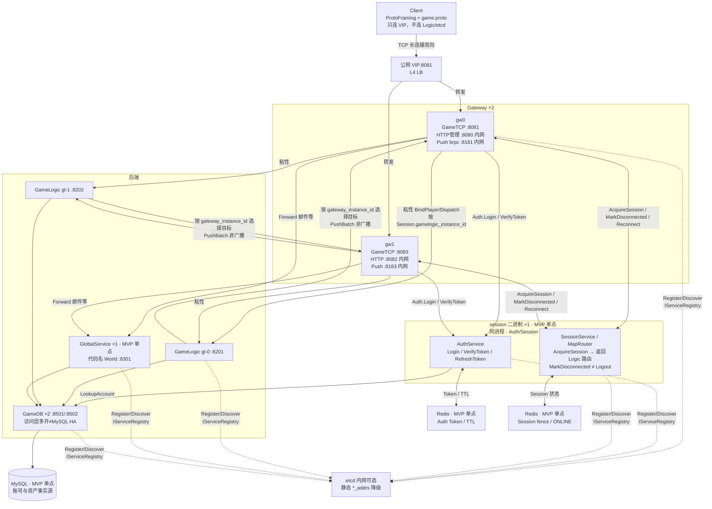

# GameMesh 拓扑（登录边界 / Push / LB 修正）

> 二进制 `world` = 逻辑服务 **GlobalService**（邮件等）。  
> Session/Auth、GlobalService、Redis、MySQL 标注为 **MVP 单点**。  
> `GameDB ×2` 只是访问层多实例，**不代表 MySQL HA**。  
> etcd 未启用时使用静态 `logic_addrs` / `session_addrs` / `world_addrs` / `gamedb_addrs` 降级。



## 登录调用链

```text
1. Client → VIP:8081 → Gateway：GameRequest.login
2. Gateway → AuthService.Login（查账号 / 发 access_token；不创建 Session）
3. Auth 失败 → 直接失败回包（不 AcquireSession）
4. Gateway → SessionService.AcquireSession
5. Session → Gateway：session_id, fence_token, gamelogic_instance_id,
                      map_instance_id, map_owner_epoch, route_version
6. Gateway → 指定 GameLogic：BindPlayer（粘性 instance）
7. Bind 失败 → Session.Logout 回滚
8. Gateway → Client：GameResponse.login（LoginSuccess）
```

后续命令由 Gateway 按粘性 `gamelogic_instance_id` 转发，并填写可信字段：
`player_id, session_id, fence_token, gamelogic_instance_id, map_instance_id, map_owner_epoch, route_version`。

## Push

GameLogic 只保存 `player_id / session_id / gateway_instance_id`，按 **target gateway** 调 `GatewayPushService.PushBatch`；旧 `session_id` 由 Gateway 拒绝。

## 断线

`MarkDisconnected` → `DISCONNECTED` + 重连宽限期；宽限内可从任意 Gateway `Reconnect`。仅主动退出 / 踢下线 / 宽限期超时 / 强制下线才 Logout。
